# 需求分析规格说明书

## WebChat 企业级在线即时通讯系统

| 文档版本 | 修改日期 | 修改人 | 修改说明 |
|----------|----------|--------|----------|
| V1.0 | 2026-05-13 | 架构组 | 初始完整版本 |
| V1.1 | 2026-05-13 | 架构组 | 企业级需求完整补充 |

---

## 第1章 引言

### 1.1 编写目的

本文档旨在全面、清晰地定义 WebChat 企业级在线即时通讯系统的功能性需求与非功能性需求，为后续的系统设计、开发实现、测试验证及项目验收提供精确依据。本文档的目标读者包括：项目经理、架构师、开发工程师、测试工程师、运维工程师及业务方代表。

### 1.2 项目背景

#### 1.2.1 行业现状

随着远程办公和混合办公模式的普及，企业对即时通讯系统的需求已从"能聊天"升级为"安全、高效、可管控的企业协作平台"。据 Gartner 2025 年报告，企业级即时通讯市场年增长率达 18.7%，企业对数据安全、消息审计、系统集成能力的要求日益提高。

#### 1.2.2 问题分析

| 问题编号 | 问题描述 | 影响范围 |
|----------|----------|----------|
| P01 | 现有公共 IM 工具(微信/QQ)无法满足企业数据安全与审计需求 | 全企业 |
| P02 | 员工使用个人 IM 沟通工作，离职后客户关系无法留存 | 销售/客服 |
| P03 | 缺乏统一的群组管理和权限管控机制 | 管理层 |
| P04 | 音视频通话依赖第三方，质量和安全不可控 | 全员 |
| P05 | 消息记录分散，无法集中审计和合规审查 | 合规/法务 |

#### 1.2.3 业务目标

| 目标编号 | 目标描述 | 成功标准 | 时间窗口 |
|----------|----------|----------|----------|
| G01 | 建立企业内部统一通讯平台 | 全企业采用率 > 90% | 上线后 3 个月 |
| G02 | 实现消息全链路审计与合规 | 审计覆盖率 100% | 上线即达成 |
| G03 | 消息端到端延迟 < 200ms | P95 延迟达标 | 上线即达成 |
| G04 | 支持 10,000+ 并发在线用户 | 压测通过 | 上线前验证 |
| G05 | 系统可用性达 99.9% | 全年宕机 < 8.76h | 持续运营 |

### 1.3 项目范围

#### 1.3.1 功能范围（In-Scope）

| 模块 | 核心功能 |
|------|----------|
| 用户管理 | 注册、登录、个人资料管理、头像上传 |
| 好友管理 | 搜索用户、发送/处理好友请求、好友分组、备注 |
| 私聊 | 文本/图片/文件/语音消息、消息撤回、已读状态 |
| 群组管理 | 创建群组、邀请成员、权限管理、禁言、公告 |
| 群聊 | 群内文本/图片/文件消息、消息撤回 |
| 音视频通话 | 一对一语音/视频通话、Aliyun RTC 支持 |
| 表情包 | 系统表情、自定义表情上传/管理 |
| 好友印象 | 添加/查看/删除印象标签 |
| 系统通知 | 管理员发送、用户接收、已读追踪 |
| 管理后台 | 用户管理、消息审计、数据统计、通知管理 |

#### 1.3.2 非功能范围（Out-of-Scope）

- 多端同步（Web/移动端/桌面端本期仅实现 Web）
- 消息端到端加密（E2EE）
- 文件在线预览编辑
- 第三方集成（OA/ERP 对接）
- 国际化多语言支持

### 1.4 术语表

| 术语 | 英文 | 定义 |
|------|------|------|
| 即时通讯 | IM | Instant Messaging，实时消息传递 |
| JWT | JSON Web Token | 无状态认证令牌 |
| WebSocket | WebSocket | 全双工通信协议 |
| RTC | Real-Time Communication | 实时音视频通信 |
| OSS | Object Storage Service | 对象存储服务 |
| BCrypt | BCrypt | 密码哈希算法 |
| SLA | Service Level Agreement | 服务等级协议 |

---

## 第2章 利益相关者分析

### 2.1 利益相关者清单

| 角色 | 关注点 | 影响力 | 参与阶段 |
|------|--------|:------:|----------|
| 企业管理者 | 数据安全、管控能力、ROI | 高 | 立项、验收 |
| IT 管理员 | 运维便捷性、可审计性、权限管理 | 高 | 部署、运营 |
| 普通员工 | 易用性、稳定性、功能完整性 | 中 | 日常使用 |
| 开发团队 | 架构可扩展性、技术可行性 | 中 | 开发、测试 |
| 测试团队 | 功能完整性、性能指标、边界覆盖 | 中 | 测试 |
| 安全审计 | 安全性、合规性、日志完整性 | 高 | 审计 |

---

## 第3章 用户角色分析

### 3.1 角色层次结构图

> 请在 Word 中通过插件或在线工具将以下 Mermaid 代码渲染为图片

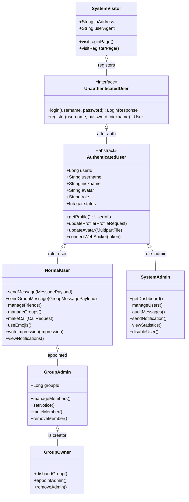

### 3.2 角色详细定义

| 角色名称 | 描述 | 创建方式 | 数量级 |
|----------|------|----------|:------:|
| 访客 | 未登录用户，仅可访问登录/注册页面 | 自动 | 不限 |
| 普通用户 | 已认证的聊天用户，使用全部聊天功能 | 注册/邀请 | 1,000-100,000 |
| 群管理员 | 被群主指定的群内管理者 | 群主任命 | 群规模 * 20% |
| 群主 | 群组创建者，拥有群最高权限 | 创建群组 | 群数量 |
| 系统管理员 | 后台管理者，拥有系统管控权限 | 数据库直接指定 | 1-10 |

### 3.3 权限矩阵

| 功能模块 | 操作 | 访客 | 普通用户 | 群管理员 | 群主 | 系统管理员 |
|----------|------|:----:|:--------:|:--------:|:----:|:----------:|
| 认证 | 注册 | ✓ | - | - | - | - |
| 认证 | 登录 | ✓ | - | - | - | - |
| 用户 | 查看个人资料 | - | ✓ | ✓ | ✓ | ✓ |
| 用户 | 修改个人资料 | - | ✓ | ✓ | ✓ | ✓ |
| 用户 | 上传头像 | - | ✓ | ✓ | ✓ | ✓ |
| 私聊 | 发送消息 | - | ✓ | ✓ | ✓ | - |
| 私聊 | 撤回消息(自己) | - | ✓ | ✓ | ✓ | - |
| 私聊 | 查看历史记录 | - | ✓ | ✓ | ✓ | - |
| 好友 | 搜索用户 | - | ✓ | ✓ | ✓ | - |
| 好友 | 发送好友请求 | - | ✓ | ✓ | ✓ | - |
| 好友 | 处理好友请求 | - | ✓ | ✓ | ✓ | - |
| 好友 | 删除好友 | - | ✓ | ✓ | ✓ | - |
| 好友 | 移动分组 | - | ✓ | ✓ | ✓ | - |
| 好友 | 设置备注 | - | ✓ | ✓ | ✓ | - |
| 群组 | 创建群组 | - | ✓ | ✓ | ✓ | - |
| 群组 | 邀请成员 | - | ✓ | ✓ | ✓ | - |
| 群组 | 退出群组 | - | ✓ | ✓ | ✓ | - |
| 群组 | 修改群公告 | - | - | ✓ | ✓ | - |
| 群组 | 移除成员 | - | - | ✓ | ✓ | - |
| 群组 | 禁言成员 | - | - | ✓ | ✓ | - |
| 群组 | 设置管理员 | - | - | - | ✓ | - |
| 群组 | 解散群组 | - | - | - | ✓ | - |
| 群聊 | 发送群消息 | - | ✓ | ✓ | ✓ | - |
| 通话 | 发起音视频通话 | - | ✓ | ✓ | ✓ | - |
| 表情 | 使用系统表情 | - | ✓ | ✓ | ✓ | ✓ |
| 表情 | 上传自定义表情 | - | ✓ | ✓ | ✓ | - |
| 印象 | 添加印象 | - | ✓ | ✓ | ✓ | - |
| 印象 | 查看印象 | - | ✓ | ✓ | ✓ | - |
| 通知 | 查看系统通知 | - | ✓ | ✓ | ✓ | ✓ |
| 管理 | 用户管理 | - | - | - | - | ✓ |
| 管理 | 消息审计 | - | - | - | - | ✓ |
| 管理 | 发送系统通知 | - | - | - | - | ✓ |
| 管理 | 查看统计数据 | - | - | - | - | ✓ |
| 管理 | 禁用/启用用户 | - | - | - | - | ✓ |

---

## 第4章 功能性需求

### 4.1 功能模块总览

> 请在 Word 中通过插件或在线工具将以下 Mermaid 代码渲染为图片

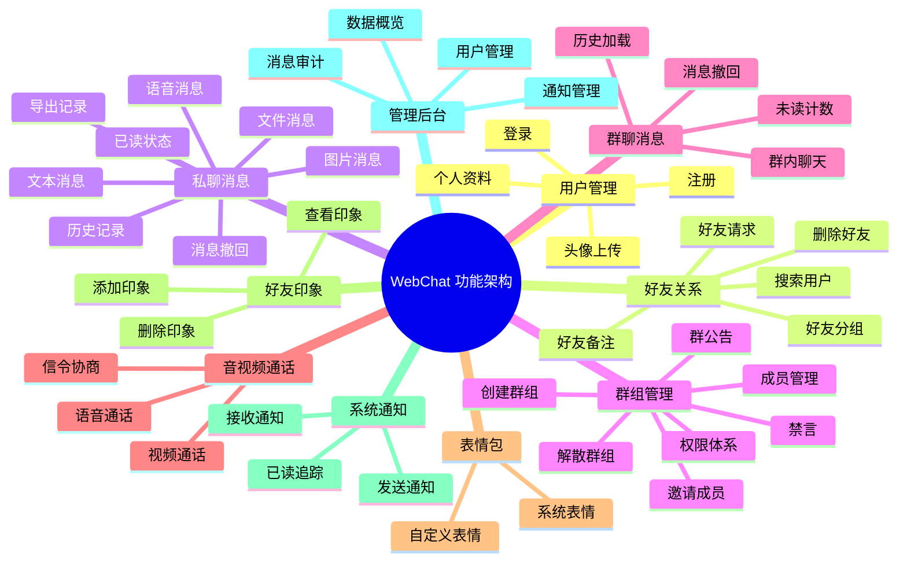

### 4.2 功能需求详细描述

#### 4.2.1 用户管理模块 (UM)

**用例图**:

> 请在 Word 中通过插件或在线工具将以下 Mermaid 代码渲染为图片

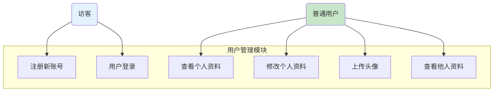

| 需求编号 | 需求名称 | 详细描述 | 优先级 | 来源 |
|----------|----------|----------|:------:|------|
| UM-F-01 | 用户注册 | 用户通过用户名+密码+昵称注册新账号。用户名全网唯一，密码使用 BCrypt 加密存储。注册成功后自动登录。 | P0 | 业务需求 |
| UM-F-02 | 用户登录 | 用户通过用户名+密码登录，服务端校验后返回 JWT Token（有效期 24h）和用户信息。 | P0 | 业务需求 |
| UM-F-03 | 获取当前用户信息 | 登录用户可获取自己的完整资料（含角色、状态、最后登录时间等）。 | P0 | 业务需求 |
| UM-F-04 | 修改个人资料 | 用户可修改昵称和个性签名。 | P1 | 业务需求 |
| UM-F-05 | 上传头像 | 用户可上传头像图片，上传至 Aliyun OSS，返回头像 URL 并更新用户资料。 | P1 | 业务需求 |
| UM-F-06 | 查看他人公开资料 | 用户可查看其他用户的公开信息（用户名、昵称、头像、签名）。 | P1 | 业务需求 |

#### 4.2.2 好友关系模块 (FR)

**用例图**:

> 请在 Word 中通过插件或在线工具将以下 Mermaid 代码渲染为图片

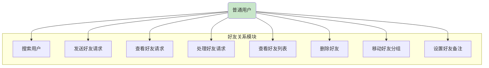

| 需求编号 | 需求名称 | 详细描述 | 优先级 | 来源 |
|----------|----------|----------|:------:|------|
| FR-F-01 | 搜索用户 | 通过关键词（用户名/昵称）搜索平台用户，返回匹配列表并标记好友关系状态。 | P0 | 业务需求 |
| FR-F-02 | 发送好友请求 | 向目标用户发送好友请求，可附带验证消息。同一对用户不能重复发送待处理请求。 | P0 | 业务需求 |
| FR-F-03 | 查看好友请求 | 查看所有收到的好友请求列表，含发送方信息和状态。 | P0 | 业务需求 |
| FR-F-04 | 处理好友请求 | 同意或拒绝好友请求。同意后自动建立双向好友关系，拒绝后请求标记为已拒绝。 | P0 | 业务需求 |
| FR-F-05 | 查看好友列表 | 按分组返回好友列表，每条记录含在线状态、未读数、置顶标识。 | P0 | 业务需求 |
| FR-F-06 | 删除好友 | 解除好友关系，双向删除。删除后聊天记录保留但不再展示在好友列表。 | P1 | 业务需求 |
| FR-F-07 | 移动好友分组 | 将好友移动到指定分组。分组不存在时自动创建。 | P2 | 体验优化 |
| FR-F-08 | 设置好友备注 | 为好友设置自定义备注名称，优先显示备注而非昵称。 | P2 | 体验优化 |

**好友请求业务活动图**:

> 请在 Word 中通过插件或在线工具将以下 Mermaid 代码渲染为图片

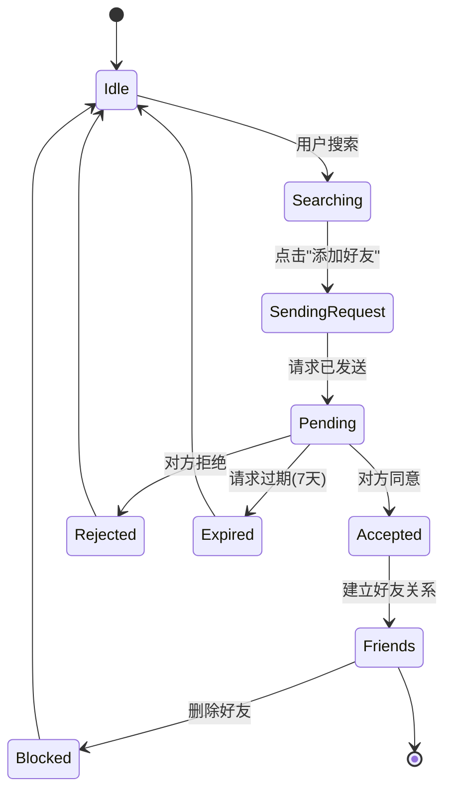

#### 4.2.3 私聊消息模块 (MSG)

**用例图**:

> 请在 Word 中通过插件或在线工具将以下 Mermaid 代码渲染为图片

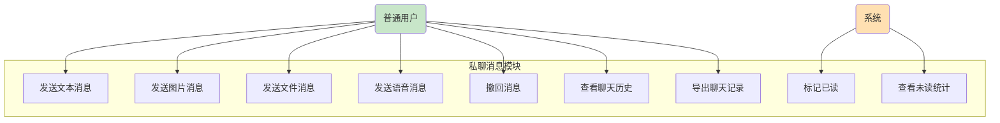

| 需求编号 | 需求名称 | 详细描述 | 优先级 | 来源 |
|----------|----------|----------|:------:|------|
| MSG-F-01 | 发送文本消息 | 用户向好友发送文本消息，通过 WebSocket 实时推送，消息持久化到 MySQL。 | P0 | 核心功能 |
| MSG-F-02 | 发送图片消息 | 上传图片至 OSS，将图片 URL 作为消息内容发送。支持常见图片格式(jpg/png/gif/webp)，单文件 < 10MB。 | P0 | 核心功能 |
| MSG-F-03 | 发送文件消息 | 上传文件至 OSS，将文件 URL 和文件名作为消息内容发送。单文件 < 50MB。 | P1 | 业务需求 |
| MSG-F-04 | 发送语音消息 | 录制语音上传 OSS，发送消息附带语音 URL 和时长信息。 | P1 | 业务需求 |
| MSG-F-05 | 撤回消息 | 发送后 2 分钟内可撤回，撤回后双方均显示"对方撤回了一条消息"。 | P1 | 业务需求 |
| MSG-F-06 | 查看聊天历史 | 分页加载与某好友的聊天记录，按时间倒序排列，支持无限滚动上拉加载。 | P0 | 核心功能 |
| MSG-F-07 | 导出聊天记录 | 将聊天记录导出为 `.txt` 文件下载到本地。 | P2 | 体验优化 |
| MSG-F-08 | 标记消息已读 | 打开聊天窗口时，自动将该好友发来的未读消息标记为已读。 | P0 | 核心功能 |
| MSG-F-09 | 未读消息统计 | 展示每个好友的未读消息数量和最后一条消息预览。 | P0 | 核心功能 |

**私聊消息完整流程**:

> 请在 Word 中通过插件或在线工具将以下 Mermaid 代码渲染为图片

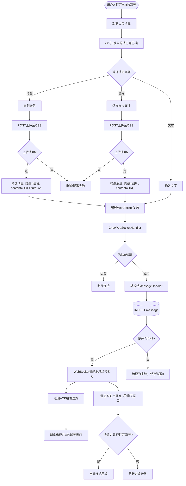

#### 4.2.4 群组管理模块 (GRP)

**用例图**:

> 请在 Word 中通过插件或在线工具将以下 Mermaid 代码渲染为图片

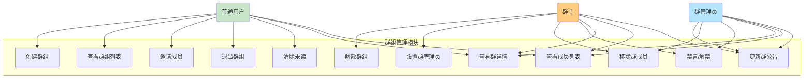

| 需求编号 | 需求名称 | 详细描述 | 优先级 | 来源 |
|----------|----------|----------|:------:|------|
| GRP-F-01 | 创建群组 | 用户创建群组，填写群名称，可选邀请初始成员。创建者自动成为群主。 | P0 | 核心功能 |
| GRP-F-02 | 查看群组列表 | 返回用户加入的所有群组，含未读消息数、最后一条消息预览。 | P0 | 核心功能 |
| GRP-F-03 | 获取群详情 | 查看群组详细信息（名称、头像、成员数、公告、我的角色）。 | P0 | 核心功能 |
| GRP-F-04 | 邀请成员 | 邀请好友加入群组。被邀请者直接加入（无需同意）。 | P0 | 业务需求 |
| GRP-F-05 | 退出群组 | 成员主动退出群组。群主不能退出，需先转让群主或解散。 | P0 | 业务需求 |
| GRP-F-06 | 解散群组 | 仅群主可解散群组，解散后所有成员关系解除。 | P0 | 业务需求 |
| GRP-F-07 | 查看成员列表 | 获取群成员列表，展示角色、入群时间、禁言状态。 | P0 | 核心功能 |
| GRP-F-08 | 更新群公告 | 群主/管理员可编辑群公告，最大 200 字。 | P1 | 业务需求 |
| GRP-F-09 | 设置/取消管理员 | 群主可指定或撤销群管理员。管理员数量不限。 | P1 | 业务需求 |
| GRP-F-10 | 移除成员 | 群主/管理员可移除群成员。被移除者可重新被邀请。 | P1 | 业务需求 |
| GRP-F-11 | 禁言/解禁成员 | 群主/管理员可禁言成员。被禁言者无法发送群消息。 | P1 | 业务需求 |
| GRP-F-12 | 清除未读计数 | 用户查看群聊后，清除该群的未读消息计数。 | P0 | 核心功能 |

#### 4.2.5 群聊消息模块 (GMSG)

| 需求编号 | 需求名称 | 详细描述 | 优先级 | 来源 |
|----------|----------|----------|:------:|------|
| GMSG-F-01 | 发送群消息 | 群成员向群内发送消息（文本/图片/文件），通过 WebSocket 实时推送给所有在线群成员。 | P0 | 核心功能 |
| GMSG-F-02 | 群消息历史 | 分页加载群聊历史消息，支持上拉无限滚动。 | P0 | 核心功能 |
| GMSG-F-03 | 群消息撤回 | 发送后 2 分钟内可撤回自己的消息。 | P1 | 业务需求 |

**群聊消息推送流程**:

> 请在 Word 中通过插件或在线工具将以下 Mermaid 代码渲染为图片

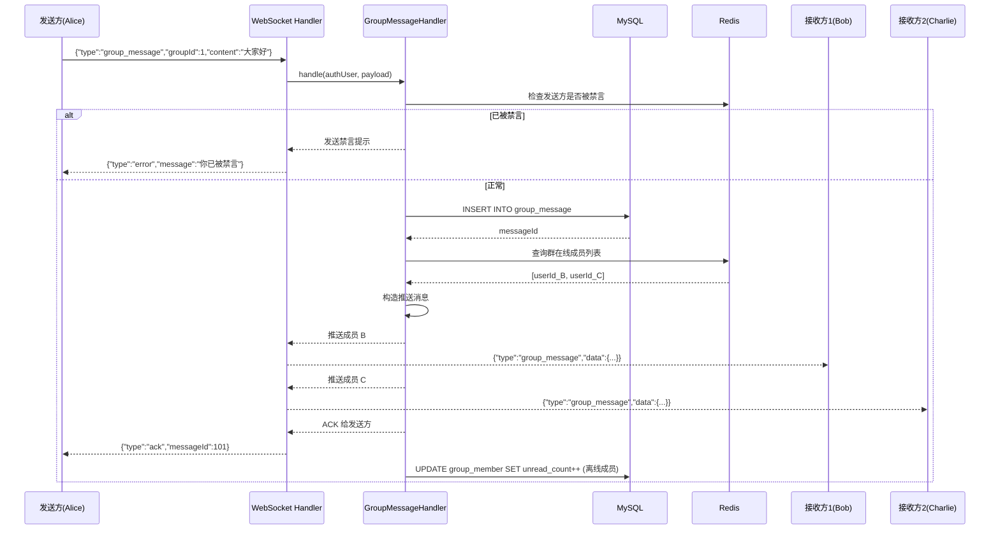

#### 4.2.6 音视频通话模块 (RTC)

| 需求编号 | 需求名称 | 详细描述 | 优先级 | 来源 |
|----------|----------|----------|:------:|------|
| RTC-F-01 | 发起通话 | 向在线好友发起语音或视频通话请求。 | P1 | 业务需求 |
| RTC-F-02 | 接听/拒绝通话 | 收到通话请求后可接听或拒绝。接听后建立 RTC 连接。 | P1 | 业务需求 |
| RTC-F-03 | 通话中控制 | 支持静音、关闭摄像头、切换摄像头、扬声器切换、挂断。 | P1 | 业务需求 |
| RTC-F-04 | 通话信令 | 通过 WebSocket 中转 SDP 和 ICE Candidate 实现信令交换。 | P1 | 技术需求 |
| RTC-F-05 | RTC Token 生成 | 服务端生成 Aliyun RTC 频道 Token，保障通话安全。 | P1 | 技术需求 |

**音视频通话信令流程**:

> 请在 Word 中通过插件或在线工具将以下 Mermaid 代码渲染为图片

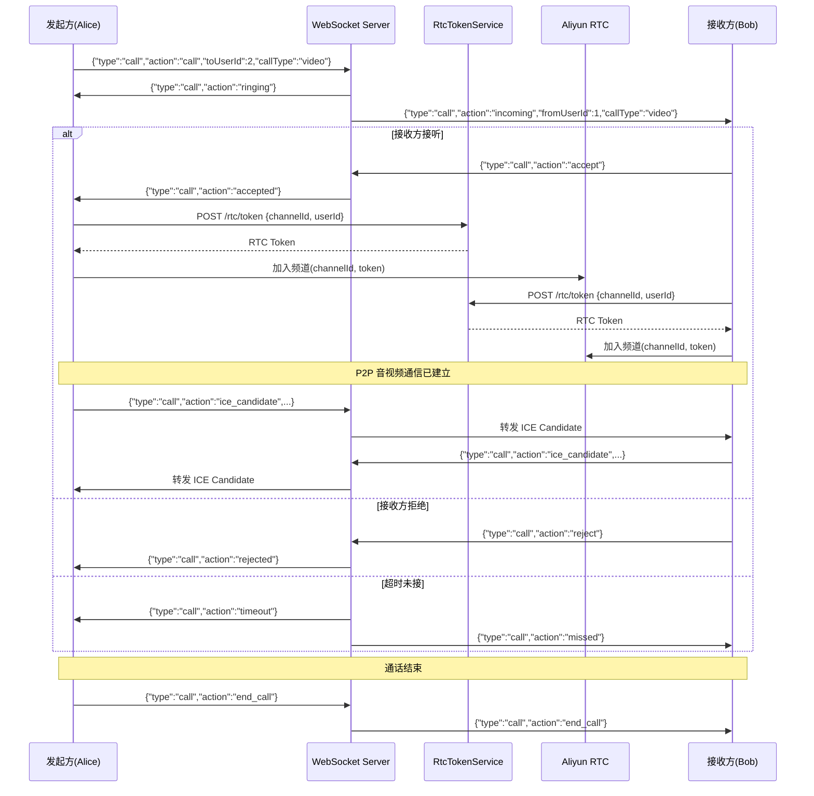

#### 4.2.7 表情包模块 (EMO)

| 需求编号 | 需求名称 | 详细描述 | 优先级 | 来源 |
|----------|----------|----------|:------:|------|
| EMO-F-01 | 获取系统表情 | 获取平台预置的系统表情包列表。 | P1 | 业务需求 |
| EMO-F-02 | 获取自定义表情 | 获取用户自己上传的自定义表情列表。 | P1 | 业务需求 |
| EMO-F-03 | 上传自定义表情 | 上传图片作为自定义表情，上传至 OSS。 | P1 | 业务需求 |
| EMO-F-04 | 删除自定义表情 | 删除用户自己上传的自定义表情。 | P1 | 业务需求 |

#### 4.2.8 好友印象模块 (IMP)

| 需求编号 | 需求名称 | 详细描述 | 优先级 | 来源 |
|----------|----------|----------|:------:|------|
| IMP-F-01 | 添加印象 | 为好友添加印象标签，如"靠谱"、"幽默"等，最长 100 字。 | P2 | 体验优化 |
| IMP-F-02 | 查看收到的印象 | 查看其他用户给我添加的所有印象标签。 | P2 | 体验优化 |
| IMP-F-03 | 查看给出的印象 | 查看我给其他用户添加的所有印象标签。 | P2 | 体验优化 |
| IMP-F-04 | 删除印象 | 删除我给出的印象标签（软删除）。 | P2 | 体验优化 |

#### 4.2.9 系统通知模块 (NTF)

| 需求编号 | 需求名称 | 详细描述 | 优先级 | 来源 |
|----------|----------|----------|:------:|------|
| NTF-F-01 | 发送系统通知 | 管理员向全平台用户发送系统通知（标题+内容）。 | P1 | 业务需求 |
| NTF-F-02 | 查看未读通知 | 用户查看所有未读的系统通知列表。 | P1 | 业务需求 |
| NTF-F-03 | 标记通知已读 | 用户将某条通知标记为已读，记录已读时间。 | P1 | 业务需求 |

#### 4.2.10 管理后台模块 (ADM)

**用例图**:

> 请在 Word 中通过插件或在线工具将以下 Mermaid 代码渲染为图片

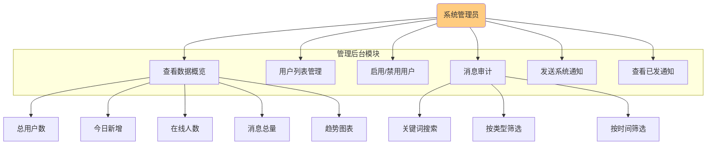

| 需求编号 | 需求名称 | 详细描述 | 优先级 | 来源 |
|----------|----------|----------|:------:|------|
| ADM-F-01 | 数据概览 | Dashboard 展示：总用户数/今日新增/在线人数/消息总量/趋势图。 | P0 | 管理需求 |
| ADM-F-02 | 用户列表 | 分页展示所有用户，支持按关键词搜索，显示用户状态。 | P0 | 管理需求 |
| ADM-F-03 | 启用/禁用用户 | 管理员可启用或禁用用户账号，禁用后用户无法登录。 | P0 | 管理需求 |
| ADM-F-04 | 消息审计 | 查看/搜索所有用户的私聊和群聊消息，支持多条件筛选。 | P0 | 合规需求 |
| ADM-F-05 | 发送系统通知 | 编写标题和内容，向全体用户发送系统通知。 | P1 | 管理需求 |
| ADM-F-06 | 查看已发通知 | 查看管理员已发送的通知历史。 | P1 | 管理需求 |

---

## 第5章 非功能性需求

### 5.1 性能需求

| 指标编号 | 指标名称 | 目标值 | 测量方法 | 优先级 |
|----------|----------|:------:|----------|:------:|
| NFR-P-01 | API 平均响应时间 | < 100ms | 通过 APM 工具（SkyWalking/Prometheus）监控 | P0 |
| NFR-P-02 | API P95 响应时间 | < 200ms | 通过 APM 工具监控 | P0 |
| NFR-P-03 | API P99 响应时间 | < 500ms | 通过 APM 工具监控 | P0 |
| NFR-P-04 | 消息端到端延迟(P95) | < 200ms | WebSocket 消息时间戳差 | P0 |
| NFR-P-05 | 消息端到端延迟(P99) | < 500ms | WebSocket 消息时间戳差 | P0 |
| NFR-P-06 | 并发在线用户数 | ≥ 10,000 | JMeter/Locust 压力测试 | P0 |
| NFR-P-07 | 系统吞吐量 (TPS) | ≥ 5,000 req/s | JMeter 压测 | P0 |
| NFR-P-08 | 页面首屏加载时间 | < 2s | Lighthouse 审计 | P1 |
| NFR-P-09 | 聊天历史加载 (100条) | < 500ms | 前端计时 | P0 |
| NFR-P-10 | 文件上传 (1MB) 耗时 | < 3s | OSS 上传计时 | P1 |
| NFR-P-11 | 数据库查询时间 (P99) | < 200ms | 慢查询日志 + SkyWalking | P0 |
| NFR-P-12 | WebSocket 连接数 | ≥ 10,000 | 并发连接测试 | P0 |
| NFR-P-13 | 音视频通话延迟 | < 300ms | RTC SDK 报告 | P1 |
| NFR-P-14 | 系统资源: CPU 使用率 | < 70% (压测下) | Prometheus + Grafana | P0 |
| NFR-P-15 | 系统资源: 内存使用率 | < 80% (压测下) | Prometheus + Grafana | P0 |

### 5.2 安全性需求

| 编号 | 需求类别 | 需求描述 | 实现方式 | 优先级 |
|------|----------|----------|----------|:------:|
| NFR-S-01 | 身份认证 | 用户必须通过 JWT Token 认证才能访问受保护资源 | JWT + 拦截器 | P0 |
| NFR-S-02 | 密码存储 | 密码不得以明文形式存储 | BCrypt 哈希 + Salt | P0 |
| NFR-S-03 | 传输加密 | 所有数据在传输过程中必须加密 | HTTPS/WSS | P0 |
| NFR-S-04 | Token 安全 | Token 必须有有效期，过期后需重新登录 | JWT 24h 过期 | P0 |
| NFR-S-05 | 接口鉴权 | API 需按角色和权限进行访问控制 | JwtInterceptor + 角色校验 | P0 |
| NFR-S-06 | WebSocket 鉴权 | WebSocket 连接时必须验证 Token | WebSocketAuthInterceptor | P0 |
| NFR-S-07 | SQL 注入防护 | 禁止拼接 SQL 语句 | MyBatis-Plus 参数绑定 | P0 |
| NFR-S-08 | XSS 防护 | 防止跨站脚本攻击 | 前端输出转义 + CSP 头 | P0 |
| NFR-S-09 | CSRF 防护 | 防止跨站请求伪造 | Token 验证 + Referer 检查 | P1 |
| NFR-S-10 | 文件上传安全 | 限制上传文件类型和大小，防止恶意文件 | OSS 策略 + 后端校验 | P0 |
| NFR-S-11 | 接口防刷 | 防止恶意频繁调用 | 接口限流 (Rate Limiting) | P1 |
| NFR-S-12 | 敏感信息保护 | 不泄露用户敏感信息（密码、Token 等） | 日志脱敏 + 响应过滤 | P0 |

### 5.3 可用性需求

| 编号 | 指标 | 目标值 | 说明 |
|------|------|:------:|------|
| NFR-A-01 | 系统可用性 (SLA) | ≥ 99.9% | 全年不可用时间 ≤ 8.76 小时 |
| NFR-A-02 | 计划外停机时间 | ≤ 8.76 小时/年 | 不包含计划内维护 |
| NFR-A-03 | 计划内维护窗口 | 每月 ≤ 2 小时 | 提前公告 |
| NFR-A-04 | 故障恢复时间 (RTO) | ≤ 30 分钟 | 从故障发生到恢复 |
| NFR-A-05 | 数据恢复点 (RPO) | ≤ 5 分钟 | 最多丢失 5 分钟数据 |
| NFR-A-06 | 数据库备份 | 每日全量 + 每 6h 增量 | 自动备份策略 |
| NFR-A-07 | 应用无状态化 | 支持水平扩展 | Session 存储在 Redis |
| NFR-A-08 | 降级方案 | 核心功能(消息收发)降级可用 | 非核心功能熔断 |

### 5.4 可维护性需求

| 编号 | 需求描述 | 实现方式 |
|------|----------|----------|
| NFR-M-01 | 模块化架构，按业务分包 | Spring Boot 模块分包 (user/friend/group/message/...) |
| NFR-M-02 | 统一响应格式 | `Result<T>` 包含 code/message/data |
| NFR-M-03 | 全局异常处理 | GlobalExceptionHandler 统一拦截 |
| NFR-M-04 | 统一错误码规范 | ResultCode 枚举管理 |
| NFR-M-05 | 日志分级记录 | LOG4J 配置，Info/Warn/Error 分级 |
| NFR-M-06 | 容器化部署 | Docker + Docker Compose |
| NFR-M-07 | 配置外部化 | application.yaml + 环境变量 |
| NFR-M-08 | 健康检查 | Spring Boot Actuator + /actuator/health |

### 5.5 可扩展性需求

| 编号 | 需求描述 | 说明 |
|------|----------|------|
| NFR-E-01 | 应用层水平扩展 | 无状态设计 + Redis 共享 Session |
| NFR-E-02 | 数据库读写分离 | 主库写 + 从库读，支持一主多从 |
| NFR-E-03 | Redis 集群化 | 支持 Redis Cluster 或 Sentinel |
| NFR-E-04 | 消息队列解耦 | 预留消息队列集成点（后续引入 RabbitMQ/Kafka） |
| NFR-E-05 | 静态资源 CDN | OSS + CDN 加速静态资源 |

### 5.6 可测试性需求

| 编号 | 需求描述 |
|------|----------|
| NFR-T-01 | 单元测试覆盖率 ≥ 70%（Service 层） |
| NFR-T-02 | API 自动化测试覆盖所有核心接口 |
| NFR-T-03 | WebSocket 消息需支持 Mock 测试 |
| NFR-T-04 | Docker Compose 一键拉起测试环境 |
| NFR-T-05 | 支持 JMeter 压测脚本 |

---

## 第6章 需求跟踪矩阵 (RTM)

| 需求编号 | 需求名称 | 优先级 | 模块 | 测试用例 | 设计文档 | 开发状态 |
|----------|----------|:------:|------|:--------:|:--------:|:--------:|
| UM-F-01 | 用户注册 | P0 | user | TC-UM-01~TC-UM-05 | DS-UM-01 | - |
| UM-F-02 | 用户登录 | P0 | user | TC-UM-06~TC-UM-10 | DS-UM-02 | - |
| UM-F-03 | 获取用户信息 | P0 | user | TC-UM-11~TC-UM-12 | DS-UM-03 | - |
| UM-F-04 | 修改个人资料 | P1 | user | TC-UM-13~TC-UM-14 | DS-UM-04 | - |
| UM-F-05 | 上传头像 | P1 | user | TC-UM-15~TC-UM-17 | DS-UM-05 | - |
| UM-F-06 | 查看他人资料 | P1 | user | TC-UM-18 | DS-UM-06 | - |
| FR-F-01 | 搜索用户 | P0 | friend | TC-FR-01~TC-FR-03 | DS-FR-01 | - |
| FR-F-02 | 发送好友请求 | P0 | friend | TC-FR-04~TC-FR-07 | DS-FR-02 | - |
| FR-F-03 | 查看好友请求 | P0 | friend | TC-FR-08 | DS-FR-03 | - |
| FR-F-04 | 处理好友请求 | P0 | friend | TC-FR-09~TC-FR-11 | DS-FR-04 | - |
| FR-F-05 | 查看好友列表 | P0 | friend | TC-FR-12 | DS-FR-05 | - |
| FR-F-06 | 删除好友 | P1 | friend | TC-FR-13~TC-FR-14 | DS-FR-06 | - |
| FR-F-07 | 移动好友分组 | P2 | friend | TC-FR-15 | DS-FR-07 | - |
| FR-F-08 | 设置好友备注 | P2 | friend | TC-FR-16 | DS-FR-08 | - |
| MSG-F-01~09 | 私聊消息 | P0 | message | TC-MSG-01~TC-MSG-20 | DS-MSG-01~09 | - |
| GRP-F-01~12 | 群组管理 | P0/P1 | group | TC-GRP-01~TC-GRP-30 | DS-GRP-01~12 | - |
| GMSG-F-01~03 | 群聊消息 | P0/P1 | group | TC-GMSG-01~TC-GMSG-10 | DS-GMSG-01~03 | - |
| RTC-F-01~05 | 音视频通话 | P1 | rtc | TC-RTC-01~TC-RTC-08 | DS-RTC-01~05 | - |
| EMO-F-01~04 | 表情包 | P1 | emoji | TC-EMO-01~TC-EMO-08 | DS-EMO-01~04 | - |
| IMP-F-01~04 | 好友印象 | P2 | impression | TC-IMP-01~TC-IMP-08 | DS-IMP-01~04 | - |
| NTF-F-01~03 | 系统通知 | P1 | notification | TC-NTF-01~TC-NTF-06 | DS-NTF-01~03 | - |
| ADM-F-01~06 | 管理后台 | P0/P1 | admin | TC-ADM-01~TC-ADM-15 | DS-ADM-01~06 | - |

---

## 第7章 假设与约束

### 7.1 假设

| 编号 | 假设内容 | 影响 |
|------|----------|------|
| A01 | 用户使用现代浏览器（Chrome 90+/Firefox 90+/Edge 90+） | 兼容性测试范围 |
| A02 | 服务器网络带宽充足，支持并发消息推送 | 性能测试前提 |
| A03 | Aliyun OSS 和 RTC 服务可用性由阿里云保障 | 不纳入本系统 SLA |
| A04 | 用户具备基本网络使用能力 | 培训成本忽略 |
| A05 | MySQL 数据库单表数据量在 1 亿以内 | 分表策略触发条件 |

### 7.2 约束

| 编号 | 约束内容 | 来源 |
|------|----------|------|
| C01 | 必须使用 Spring Boot 3.x + Vue 3 技术栈 | 技术选型决策 |
| C02 | 数据库必须使用 MySQL 8.0 | 基础设施决策 |
| C03 | 项目周期 6 个月 | 项目计划 |
| C04 | 开发团队 5 人（3 后端 + 2 前端） | 资源限制 |
| C05 | 必须支持 Docker 容器化部署 | 运维要求 |

---

## 第8章 风险评估与管理

| 风险编号 | 风险描述 | 概率 | 影响 | 风险等级 | 应对措施 |
|----------|----------|:----:|:----:|:--------:|----------|
| R01 | 高并发场景下 WebSocket 连接数超过服务器上限 | 中 | 高 | 高 | 水平扩展 + Nginx 负载均衡 + 连接数监控告警 |
| R02 | 消息丢失导致用户投诉 | 低 | 高 | 中 | MySQL 持久化 + ACK 确认机制 + 消息补偿 |
| R03 | Aliyun OSS/RTC 服务故障 | 低 | 中 | 中 | 多区域冗余 + 降级方案 |
| R04 | 数据库慢查询影响消息收发 | 中 | 高 | 高 | 索引优化 + 慢查询监控 + 读写分离 |
| R05 | 用户密码泄露 | 低 | 高 | 中 | BCrypt 加密 + HTTPS + 定期密码策略 |
| R06 | 项目延期 | 中 | 中 | 中 | 敏捷开发 + MVP 优先 + 每周进度评审 |
| R07 | 前端兼容性问题 | 低 | 低 | 低 | 浏览器兼容性测试 + Polyfill |
| R08 | 恶意用户刷接口 | 中 | 中 | 中 | 限流 + IP 黑名单 + 验证码 |

---

## 第9章 附录

### 9.1 需求优先级定义

| 优先级 | 定义 | 交付要求 |
|:------:|------|----------|
| P0 | 核心功能，必须交付 | 第一迭代完成 |
| P1 | 重要功能，建议交付 | 第二迭代完成 |
| P2 | 增强功能，条件允许时交付 | 第三迭代或延后 |

### 9.2 文档批准

| 角色 | 姓名 | 签字 | 日期 |
|------|------|:----:|------|
| 产品经理 | - | - | - |
| 技术架构师 | - | - | - |
| 项目经理 | - | - | - |
| QA 负责人 | - | - | - |
