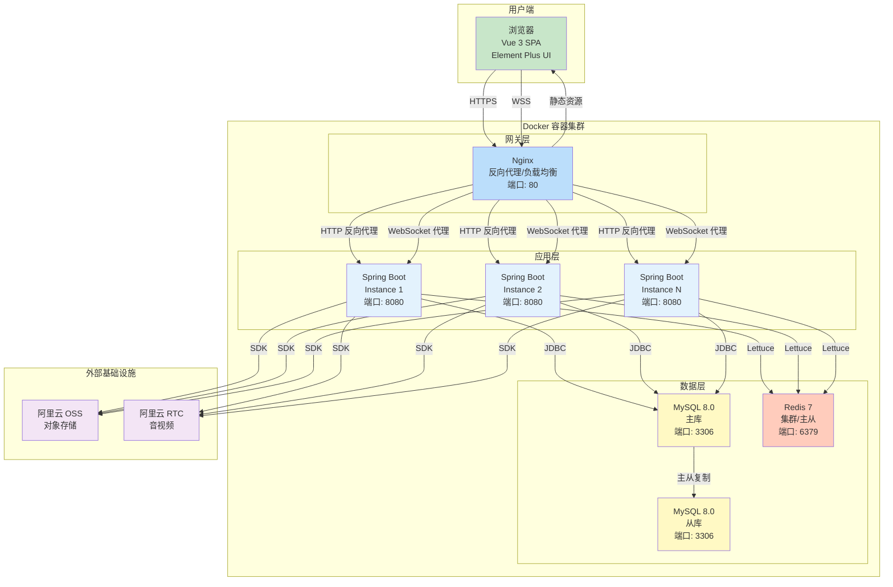
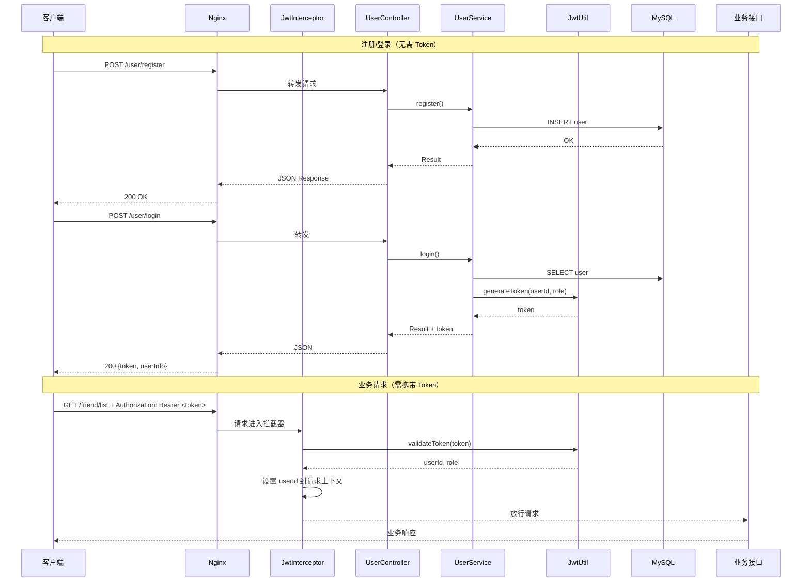
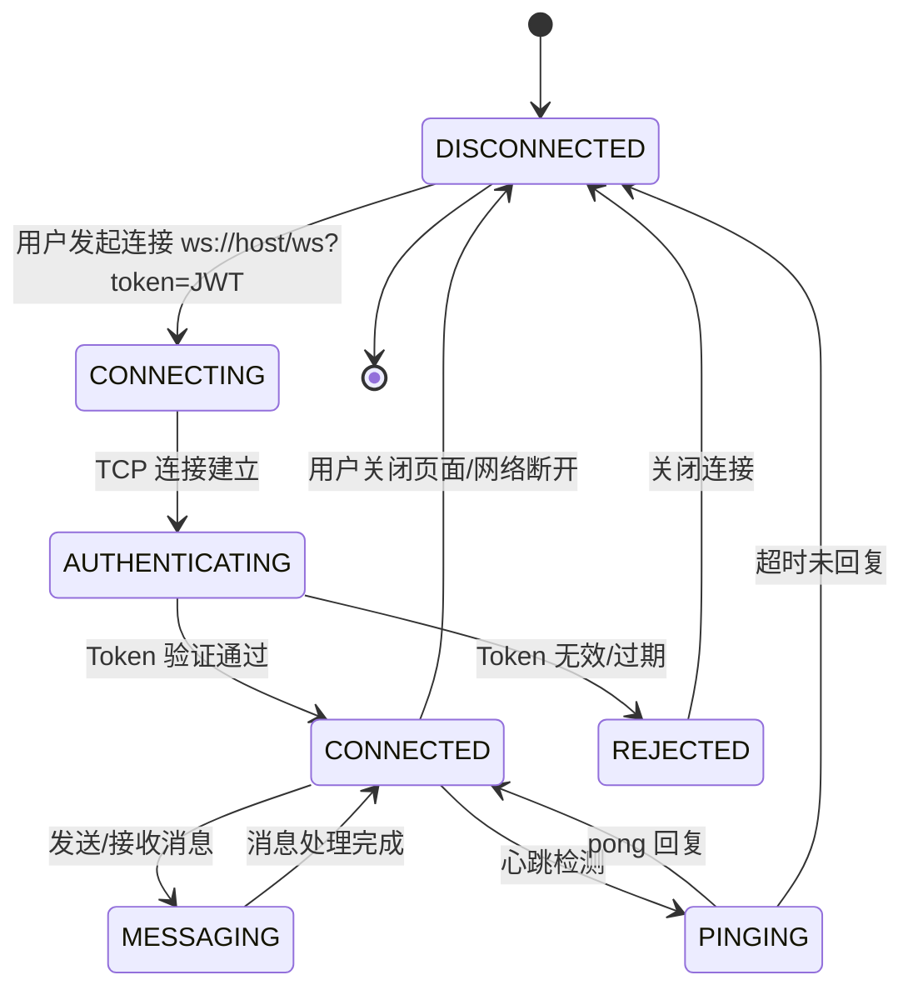
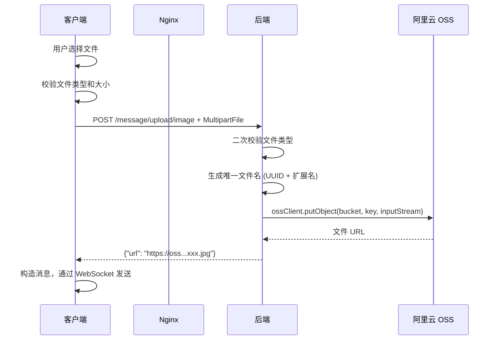
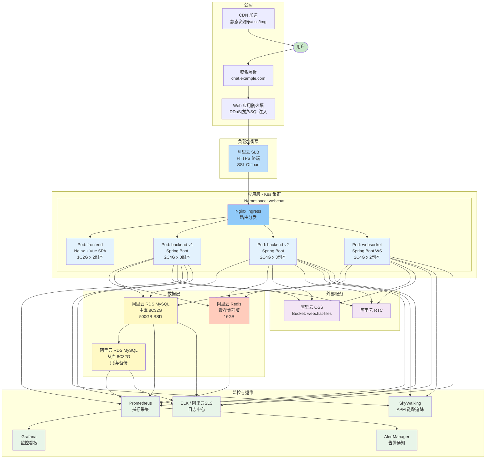
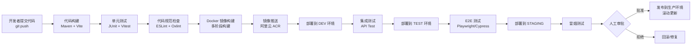

# 系统设计说明书

## WebChat 企业级在线即时通讯系统

| 文档版本 | 修改日期 | 修改人 | 修改说明 |
|----------|----------|--------|----------|
| V1.0 | 2026-05-13 | 架构组 | 企业级完整系统设计 |

---

## 第1章 系统概述

### 1.1 设计目标

| 目标 | 说明 |
|------|------|
| 高可用 | 系统可用性 ≥ 99.9%，支持故障自动恢复 |
| 高并发 | 支持 10,000+ 并发在线用户，5,000+ TPS |
| 可扩展 | 无状态应用层设计，支持水平扩展 |
| 可维护 | 模块化架构，统一规范，易于团队协作 |
| 安全性 | 全链路鉴权，数据加密存储传输 |

### 1.2 设计原则

| 原则 | 说明 |
|------|------|
| SOLID 原则 | 单一职责、开闭原则、接口隔离等 |
| 关注点分离 | 按业务模块拆分，各层职责清晰 |
| 约定优于配置 | Spring Boot 自动装配，降低配置复杂度 |
| 防御性编程 | 参数校验、异常处理、边界保护 |
| 无状态设计 | Session 外置到 Redis，支持水平扩展 |
| 异步优先 | WebSocket 实时通信，非核心操作异步化 |

---

## 第2章 系统架构设计 (C4 模型)

### 2.1 上下文图 (C1 - System Context)

> 请在 Word 中通过插件或在线工具将以下 Mermaid 代码渲染为图片

```mermaid
flowchart TB
    subgraph "用户"
        U[普通用户<br/>使用聊天功能]
        A[管理员<br/>管理平台]
    end

    subgraph "WebChat 系统"
        WC[WebChat<br/>在线即时通讯系统<br/>[Spring Boot + Vue 3]]
    end

    subgraph "外部系统"
        ALI_OSS[阿里云 OSS<br/>文件/图片存储]
        ALI_RTC[阿里云 RTC<br/>音视频服务]
        CDN[CDN<br/>静态资源加速]
    end

    U -->|使用浏览器访问| WC
    A -->|登录管理后台| WC
    WC -->|上传/下载文件| ALI_OSS
    WC -->|获取RTC Token| ALI_RTC
    U -->|加载静态资源| CDN
    WC -->|部署于| DOCKER[Docker 容器环境]

    style U fill:#c8e6c9
    style A fill:#ffcc80
    style WC fill:#e3f2fd,stroke:#1565c0
    style ALI_OSS fill:#fff3e0
    style ALI_RTC fill:#fff3e0
    style CDN fill:#f3e5f5
```

### 2.2 容器图 (C2 - Container Diagram)

> 请在 Word 中通过插件或在线工具将以下 Mermaid 代码渲染为图片



### 2.3 组件图 (C3 - Component Diagram)

> 请在 Word 中通过插件或在线工具将以下 Mermaid 代码渲染为图片



```mermaid
flowchart TB
    subgraph "Spring Boot 应用容器"
        direction TB
        
        subgraph "Web 层"
            REST[REST Controllers<br/>User/Friend/Group/Message<br/>Emoji/Impression/Admin/RTC]
            WS[ChatWebSocketHandler<br/>WebSocket 入口]
        end
        
        subgraph "业务层"
            US[UserService]
            FS[FriendService]
            GS[GroupService]
            MS[MessageService]
            ES[EmojiService]
            IS[ImpressionService]
            NS[NotificationService]
            AS[AdminService]
            RT[RtcTokenService]
        end
        
        subgraph "数据访问层"
            UM[UserMapper]
            FM[FriendMapper]
            GM[GroupMapper]
            MM[MessageMapper]
            EM[EmojiMapper]
            IM[ImpressionMapper]
            NM[NotificationMapper]
        end
        
        subgraph "基础设施"
            JWT[JwtUtil<br/>JWT 工具类]
            JI[JwtInterceptor<br/>JWT 拦截器]
            OSS_UTIL[OssUtil<br/>OSS 工具类]
            RU[RedisUtil<br/>Redis 工具类]
            RES[Result&lt;T&gt;统一响应]
            EXH[GlobalExceptionHandler<br/>全局异常处理]
            WS_AUTH[WebSocketAuthInterceptor<br/>WS 鉴权]
        end

        subgraph "WebSocket 处理器"
            MH[MessageHandler<br/>私聊处理]
            GH[GroupMessageHandler<br/>群聊处理]
            CSH[CallSignalHandler<br/>通话信令]
            STH[StatusHandler<br/>在线状态]
        end
    end

    REST --> US & FS & GS & MS & ES & IS & NS & AS & RT
    WS --> MH & GH & CSH & STH
    MH & GH --> MS & GS
    CSH --> RT
    US & FS & GS & MS & ES & IS & NS & AS --> UM & FM & GM & MM & EM & IM & NM
    US & FS & GS & MS & ES & IS & NS & AS --> RU
    REST & WS --> JI & WS_AUTH
    US & FS & GS & MS & ES & IS & NS & AS --> OSS_UTIL
    REST --> RES
    REST --> EXH

    style REST fill:#e3f2fd
    style WS fill:#e3f2fd
    style US fill:#c8e6c9
    style FS fill:#c8e6c9
    style GS fill:#c8e6c9
    style MS fill:#c8e6c9
    style ES fill:#c8e6c9
    style IS fill:#c8e6c9
    style NS fill:#c8e6c9
    style AS fill:#c8e6c9
    style RT fill:#c8e6c9
    style MH fill:#b3e5fc
    style GH fill:#b3e5fc
    style CSH fill:#b3e5fc
    style STH fill:#b3e5fc
```

### 2.4 代码组织

```
com.chat.chat_backend/
├── ChatBackendApplication.java          # 应用入口
├── common/                               # 公共基础设施
│   ├── constant/                         # 常量定义
│   │   ├── MessageConstants.java         # 消息类型常量
│   │   └── RedisConstants.java           # Redis Key 常量
│   ├── exception/                        # 异常体系
│   │   ├── BusinessException.java        # 业务异常
│   │   └── GlobalExceptionHandler.java   # 全局异常处理器
│   ├── result/                           # 统一响应
│   │   ├── Result.java                   # 响应包装类
│   │   └── ResultCode.java              # 响应码枚举
│   └── utils/                            # 工具类
│       ├── JwtUtil.java                  # JWT 工具
│       ├── OssUtil.java                  # OSS 工具
│       └── RedisUtil.java                # Redis 工具
├── config/                               # 配置类
│   ├── AliyunOSSProperties.java
│   ├── MybatisPlusConfig.java
│   ├── RedisConfig.java
│   ├── RtcConfig.java
│   ├── WebMvcConfig.java
│   └── WebSocketConfig.java
├── interceptor/                          # 拦截器
│   └── JwtInterceptor.java
├── modules/                              # 业务模块
│   ├── admin/                            # 管理后台
│   │   ├── controller/AdminController.java
│   │   ├── dto/                          # 数据传输对象
│   │   ├── service/impl/AdminServiceImpl.java
│   │   └── mapper/AdminMapper.java
│   ├── user/                             # 用户模块
│   │   ├── controller/UserController.java
│   │   ├── dto/request/{LoginRequest,RegisterRequest,...}
│   │   ├── dto/response/{LoginResponse,UserInfoResponse}
│   │   ├── entity/User.java
│   │   ├── mapper/UserMapper.java
│   │   └── service/impl/UserServiceImpl.java
│   ├── friend/                           # 好友模块
│   ├── group/                            # 群组模块
│   ├── message/                          # 消息模块
│   ├── emoji/                            # 表情模块
│   ├── impression/                       # 印象模块
│   ├── notification/                     # 通知模块
│   └── rtc/                              # 音视频模块
└── websocket/                            # WebSocket 服务
    ├── ChatWebSocketHandler.java
    ├── WebSocketSessionManager.java
    ├── handler/                           # 消息处理器
    └── service/                           # WS 业务服务
```

---

## 第3章 技术选型详细分析

### 3.1 后端技术栈

| 技术 | 版本 | 选型理由 | 备选方案 | 选定理由 |
|------|:----:|----------|----------|----------|
| Java | JDK 21 | 最新 LTS 版本，虚拟线程(Project Loom)支持高并发 | JDK 17/11 | 虚拟线程可简化 WebSocket 并发处理 |
| Spring Boot | 3.5.14 | 业界主流微服务框架，生态丰富 | Quarkus/Micronaut | 成熟稳定，人才储备多，社区活跃 |
| MyBatis-Plus | 3.5.7 | 增强 CRUD，Lambda 查询，分页插件 | JPA + Hibernate | 复杂查询更灵活，SQL 可控性高 |
| MySQL | 8.0.41 | 关系型数据库，ACID 事务 | PostgreSQL | 运维团队 MySQL 经验丰富 |
| Redis | 7-alpine | 高性能缓存，丰富的数据结构 | Memcached | 支持多种数据结构(Set/Hash)用于在线状态管理 |
| Spring WebSocket | 内置 | 原生 WebSocket，与 Spring 无缝集成 | Netty/Socket.IO | 无需额外依赖，与 Spring 安全管理集成方便 |
| JJWT | 0.12.6 | 轻量级 JWT 库 | Nimbus JOSE + JWT | API 简洁，文档完善 |
| Aliyun OSS SDK | 3.18.1 | 阿里云官方 SDK | MinIO(自建) | 运维成本低，自带 CDN |
| Aliyun RTC SDK | 7.2.7 | 低延迟音视频 | Agora/Zoom SDK | 与 OSS 统一云厂商，便于运维 |
| Hutool | 5.8.35 | 综合性 Java 工具库 | Guava/Apache Commons | 国产，文档中文，功能全面 |
| Maven | 3.9 | 构建工具 | Gradle | 团队 Maven 经验丰富，稳定可靠 |

### 3.2 前端技术栈

| 技术 | 版本 | 选型理由 | 备选方案 | 选定理由 |
|------|:----:|----------|----------|----------|
| Vue 3 | 3.5.32 | 渐进式框架，Composition API | React 18 | 学习曲线低，中文生态好，团队经验 |
| Vite | 8.0.8 | 极速 HMR，ESBuild 构建 | Webpack 5 | 开发体验好，构建速度快 10x+ |
| TypeScript | ~6.0 | 类型安全，IDE 提示 | JavaScript | 大型项目必备，减少运行时错误 |
| Element Plus | 2.8.8 | 企业级 Vue 3 UI 库 | Ant Design Vue | 组件丰富，文档完善，社区活跃 |
| Pinia | 3.0.4 | Vue 3 官方状态管理 | Vuex 4 | 更轻量，TypeScript 支持更好 |
| Vue Router | 5.0.4 | 官方路由 | - | 与 Vue 3 深度集成 |
| Axios | 1.7.9 | HTTP 客户端 | Fetch API | 拦截器、取消请求、超时、错误处理 |
| ECharts | 6.0.0 | 数据可视化 | Chart.js | 图表类型丰富，适合管理后台 |
| Day.js | 1.11.13 | 轻量日期库 | Moment.js | 体积小 (2KB)，API 兼容 |

### 3.3 中间件与基础设施

| 组件 | 用途 | 配置说明 |
|------|------|----------|
| Docker | 容器化运行环境 | 多阶段构建，镜像体积 < 200MB |
| Docker Compose | 多容器编排 | MySQL/Redis/Backend/Frontend 一键启动 |
| Nginx | 反向代理 + 静态资源 | 配置 WebSocket 代理、HTTPS 终端 |
| Aliyun OSS | 文件存储 | 自动 CDN 加速，Bucket 私有读写 |
| Aliyun RTC | 音视频通信 | 按需付费，全球节点覆盖 |

---

## 第4章 详细模块设计

### 4.1 用户认证与授权设计

#### 4.1.1 JWT 认证流程

> 请在 Word 中通过插件或在线工具将以下 Mermaid 代码渲染为图片



#### 4.1.2 JWT Token 结构

```json
{
    "sub": "userId:1",
    "role": "user",
    "iat": 1715500000,
    "exp": 1715586400,
    "iss": "webchat-system"
}
```

| 声明 | 说明 | 值 |
|------|------|----|
| sub | 用户标识 | `userId:{id}` |
| role | 用户角色 | `user` / `admin` |
| iat | 签发时间 | Unix 时间戳 |
| exp | 过期时间 | iat + 86400s (24h) |
| iss | 签发者 | `webchat-system` |

#### 4.1.3 密码安全策略

```
用户注册/修改密码 → 明文密码
    ↓
BCrypt.hashpw(password, BCrypt.gensalt())
    ↓
存储 hash（60 字符固定长度）
    ↓
登录校验 → BCrypt.checkpw(input, storedHash)
```

### 4.2 WebSocket 通信设计

#### 4.2.1 WebSocket 连接生命周期

> 请在 Word 中通过插件或在线工具将以下 Mermaid 代码渲染为图片



#### 4.2.2 WebSocket 消息协议

**通用消息结构**:

```json
{
    "type": "message_type",
    "data": { ... }
}
```

**客户端消息类型**:

| type | 方向 | 说明 |
|------|:----:|------|
| `message` | C→S | 发送私聊消息 |
| `group_message` | C→S | 发送群聊消息 |
| `call` | C→S | 通话信令 |
| `ping` | C→S | 心跳检测 |

**服务端消息类型**:

| type | 方向 | 说明 |
|------|:----:|------|
| `message` | S→C | 接收私聊消息 |
| `group_message` | S→C | 接收群聊消息 |
| `call` | S→C | 通话信令 |
| `online_status` | S→C | 好友在线状态变更 |
| `notification` | S→C | 新系统通知推送 |
| `friend_request` | S→C | 新好友请求推送 |
| `ack` | S→C | 消息发送确认 |
| `pong` | S→C | 心跳回复 |

#### 4.2.3 会话管理

```java
// WebSocketSessionManager 数据结构
// Redis Key: ws:user:{userId}:session
// Value: Map<String, String> → {sessionId: "xxx", connectedAt: "timestamp"}

// 用户上线操作
- 将用户 session 信息写入 Redis
- 查询用户的好友列表
- 向所有在线好友推送 "online_status: true"

// 用户下线操作
- 从 Redis 移除用户 session
- 向所有在线好友推送 "online_status: false"
```

### 4.3 消息处理设计

#### 4.3.1 私聊消息处理流程

> 请在 Word 中通过插件或在线工具将以下 Mermaid 代码渲染为图片

```mermaid
flowchart TB
    SENDER[发送方 Alice] -->|WebSocket 消息| WSH[ChatWebSocketHandler]
    WSH -->|解析 type=message| MH[MessageHandler]
    
    MH --> VALIDATE{消息校验}
    VALIDATE -->|参数不合法| ERR[返回错误消息]
    VALIDATE -->|校验通过| CHECK{接收方是否存在?}
    CHECK -->|否| ERR2[返回"用户不存在"]
    CHECK -->|是| SAVE
    
    subgraph "消息持久化"
        SAVE[(INSERT INTO message)]
        SAVE --> UPDATE_UNREAD[未读计数]
    end
    
    SAVE --> ONLINE_CHECK{接收方在线?}
    
    ONLINE_CHECK -->|在线| WS_PUSH[通过WebSocket推送]
    WS_PUSH --> ACK[返回 ACK 给发送方]
    
    ONLINE_CHECK -->|离线| OFFLINE[标记未读]
    OFFLINE --> ACK
    
    ACK --> SENDER_UI[发送方 UI 更新]
    WS_PUSH --> RECEIVER_UI[接收方 UI 实时更新]
```

#### 4.3.2 消息撤回逻辑

| 步骤 | 操作 | 说明 |
|------|------|------|
| 1 | 收到撤回请求 | `PUT /message/recall/{messageId}` |
| 2 | 校验发送者身份 | 只能撤回自己的消息 |
| 3 | 校验时间窗口 | 发送时间必须在 2 分钟内 |
| 4 | 更新数据库 | `UPDATE message SET recall_time=NOW() WHERE id=?` |
| 5 | 通知双方 | 通过 WebSocket 推送撤回事件 |
| 6 | UI 展示 | 显示"你撤回了一条消息"/"对方撤回了一条消息" |

#### 4.3.3 消息类型枚举

| 枚举值 | 类型 | 说明 | content 格式 |
|:------:|------|------|-------------|
| 1 | TEXT | 纯文本消息 | 文本内容 |
| 2 | IMAGE | 图片消息 | OSS 图片 URL |
| 3 | FILE | 文件消息 | OSS 文件 URL |
| 4 | VOICE | 语音消息 | OSS 音频 URL |

### 4.4 文件上传设计

#### 4.4.1 上传流程

> 请在 Word 中通过插件或在线工具将以下 Mermaid 代码渲染为图片



#### 4.4.2 文件上传限制

| 文件类型 | 大小限制 | 允许格式 | 存储路径 |
|----------|:--------:|----------|----------|
| 头像 | 5 MB | jpg/png/gif/webp | `avatars/{userId}/{uuid}.ext` |
| 图片消息 | 10 MB | jpg/png/gif/webp | `images/{uuid}.ext` |
| 文件消息 | 50 MB | 通用 | `files/{uuid}.ext` |
| 语音消息 | 10 MB | amr/mp3/wav | `voice/{uuid}.ext` |
| 自定义表情 | 2 MB | png/gif/webp | `emoji/{userId}/{uuid}.ext` |

### 4.5 缓存设计

#### 4.5.1 Redis 数据模型

| Key 模式 | 类型 | 说明 | 过期时间 |
|----------|:----:|------|:--------:|
| `ws:user:{userId}:session` | String | WebSocket 会话信息 | 跟随连接 |
| `user:online` | Set | 在线用户 ID 集合 | 无(持久) |
| `user:online:{userId}` | String | 用户在线详细信息 | 跟随连接 |
| `group:mute:{groupId}:{userId}` | String | 禁言状态 | 无(手动清除) |
| `user:token:{userId}` | String | 用户当前 Token | 24h |
| `rate:limit:{ip}:{api}` | String | 接口限流计数器 | 1s/1m |

#### 4.5.2 缓存策略

| 数据 | 缓存位置 | 策略 | 说明 |
|------|----------|------|------|
| 用户在线状态 | Redis Set | 实时更新 | 连接建立时加入，断开时移除 |
| 在线好友列表 | Redis Set | 实时更新 | 用户上下线时通知好友 |
| JWT Token | 客户端 + Redis | 无状态 | Redis 记录用于主动注销 |
| 禁言状态 | Redis String | 实时查询 | WebSocket 消息时检查 |
| 数据库查询 | - | 暂不缓存 | 数据一致性要求高，后续引入 |

### 4.6 异常处理设计

#### 4.6.1 异常体系

```
java.lang.RuntimeException
    └── com.chat.chat_backend.common.exception.BusinessException
            ├── code: int (业务错误码)
            └── message: String (错误信息)
```

#### 4.6.2 全局异常处理

| 异常类型 | HTTP 状态码 | 业务 code | 处理方式 |
|----------|:-----------:|:---------:|----------|
| BusinessException | 400 | 动态 | 返回具体业务错误 |
| MethodArgumentNotValidException | 400 | 400 | 参数校验失败提示 |
| MissingServletRequestParameterException | 400 | 400 | 缺少必要参数 |
| HttpMessageNotReadableException | 400 | 400 | 请求体格式错误 |
| AccessDeniedException | 403 | 403 | 无权限访问 |
| AuthenticationException | 401 | 401 | Token 无效/过期 |
| NoHandlerFoundException | 404 | 404 | 接口不存在 |
| Exception (兜底) | 500 | 500 | 服务器内部错误 |

### 4.7 日志设计

| 日志级别 | 使用场景 | 输出目标 |
|:--------:|----------|----------|
| ERROR | 系统异常、业务异常 | 文件 + 控制台 |
| WARN | 参数校验失败、降级触发 | 文件 + 控制台 |
| INFO | 关键操作日志(登录/注册/消息) | 文件 |
| DEBUG | SQL 日志、调试信息(仅开发) | 控制台 |

**关键日志点**:
- 用户登录成功/失败
- 用户注册
- 消息发送/接收
- WebSocket 连接/断开
- 文件上传
- 管理员操作(禁用用户/发送通知)

---

## 第5章 部署架构设计

### 5.1 环境规划

| 环境 | 用途 | 服务器数量 | 配置 |
|------|------|:----------:|------|
| DEV | 开发自测 | 1 台 | 4C8G |
| TEST | 功能/集成测试 | 2 台 | 8C16G |
| STAGING | 预发布验证 | 2 台 | 8C16G |
| PROD | 生产环境 | 4+ 台 | 16C32G |

### 5.2 生产环境部署拓扑

> 请在 Word 中通过插件或在线工具将以下 Mermaid 代码渲染为图片



### 5.3 Docker Compose 开发环境部署

```yaml
version: "3.8"

services:
  mysql:
    image: mysql:8.0.41
    container_name: webchat-mysql
    restart: unless-stopped
    ports:
      - "3307:3306"
    environment:
      MYSQL_ROOT_PASSWORD: ${DB_PASSWORD:-root123}
      MYSQL_DATABASE: chat_db
      MYSQL_CHARACTER_SET_SERVER: utf8mb4
      MYSQL_COLLATION_SERVER: utf8mb4_unicode_ci
    volumes:
      - mysql-data:/var/lib/mysql
      - ./MYSQL/chat_db.sql:/docker-entrypoint-initdb.d/01-chat_db.sql
      - ./MYSQL/system_notification.sql:/docker-entrypoint-initdb.d/02-system_notification.sql
    healthcheck:
      test: ["CMD", "mysqladmin", "ping", "-h", "localhost"]
      interval: 10s
      timeout: 5s
      retries: 5

  redis:
    image: redis:7-alpine
    container_name: webchat-redis
    restart: unless-stopped
    ports:
      - "6380:6379"
    volumes:
      - redis-data:/data
    command: redis-server --appendonly yes --requirepass ${REDIS_PASSWORD:-redis123}
    healthcheck:
      test: ["CMD", "redis-cli", "ping"]
      interval: 10s
      timeout: 5s
      retries: 5

  backend:
    build:
      context: ./chat-backend
      target: dev
    container_name: webchat-backend
    restart: unless-stopped
    ports:
      - "8080:8080"
    environment:
      DB_HOST: mysql
      DB_PORT: 3306
      DB_USERNAME: root
      DB_PASSWORD: ${DB_PASSWORD:-root123}
      REDIS_HOST: redis
      REDIS_PORT: 6379
      REDIS_PASSWORD: ${REDIS_PASSWORD:-redis123}
      JWT_SECRET: ${JWT_SECRET:-your-jwt-secret-key}
      OSS_ENDPOINT: ${OSS_ENDPOINT}
      OSS_ACCESS_KEY: ${OSS_ACCESS_KEY}
      OSS_SECRET_KEY: ${OSS_SECRET_KEY}
      OSS_BUCKET: ${OSS_BUCKET}
      RTC_APP_ID: ${RTC_APP_ID}
      RTC_APP_KEY: ${RTC_APP_KEY}
    depends_on:
      mysql:
        condition: service_healthy
      redis:
        condition: service_healthy
    volumes:
      - ./chat-backend/src:/app/src

  frontend:
    build:
      context: ./chat-frontend
      target: dev
    container_name: webchat-frontend
    restart: unless-stopped
    ports:
      - "80:80"
    environment:
      VITE_API_BASE_URL: /api
      VITE_WS_URL: ws://localhost:8080/ws
    depends_on:
      - backend

volumes:
  mysql-data:
  redis-data:
```

### 5.4 Nginx 配置

```nginx
# /etc/nginx/conf.d/webchat.conf

upstream backend {
    server backend:8080;
    # 生产环境多实例:
    # server 10.0.1.1:8080 weight=5;
    # server 10.0.1.2:8080 weight=5;
}

server {
    listen 80;
    server_name chat.example.com;

    # 静态资源（前端 SPA）
    root /usr/share/nginx/html;
    index index.html;

    # Gzip 压缩
    gzip on;
    gzip_types text/plain application/json application/javascript text/css image/svg+xml;
    gzip_min_length 1024;

    # API 反向代理
    location /api/ {
        proxy_pass http://backend;
        proxy_set_header Host $host;
        proxy_set_header X-Real-IP $remote_addr;
        proxy_set_header X-Forwarded-For $proxy_add_x_forwarded_for;
        proxy_set_header X-Forwarded-Proto $scheme;

        # 超时设置
        proxy_connect_timeout 10s;
        proxy_read_timeout 30s;
        proxy_send_timeout 30s;

        # 请求体大小限制（文件上传）
        client_max_body_size 100M;
    }

    # WebSocket 反向代理
    location /ws {
        proxy_pass http://backend;
        proxy_http_version 1.1;
        proxy_set_header Upgrade $http_upgrade;
        proxy_set_header Connection "upgrade";
        proxy_set_header Host $host;
        proxy_set_header X-Real-IP $remote_addr;

        # WebSocket 长连接超时
        proxy_read_timeout 3600s;
        proxy_send_timeout 3600s;
    }

    # SPA 路由（所有非 API 请求返回 index.html）
    location / {
        try_files $uri $uri/ /index.html;
    }

    # 静态资源缓存
    location ~* \.(js|css|png|jpg|jpeg|gif|ico|svg|woff2?)$ {
        expires 30d;
        add_header Cache-Control "public, immutable";
    }
}
```

---

## 第6章 安全设计

### 6.1 安全架构总览

| 安全层级 | 防护措施 |
|----------|----------|
| 网络层 | HTTPS/TLS 1.3、WAF、DDoS 防护 |
| 应用层 | JWT 鉴权、角色权限控制、参数校验 |
| 数据层 | 密码 BCrypt 加密、SQL 注入防护、敏感数据脱敏 |
| 传输层 | HTTPS/WSS 加密传输、请求签名校验 |

### 6.2 API 安全

| 措施 | 说明 | 实现 |
|------|------|------|
| Token 认证 | 所有 API（除登录/注册）需 Bearer Token | JwtInterceptor |
| 角色鉴权 | 管理 API 仅 admin 角色可访问 | Controller 层 role 校验 |
| 参数校验 | 请求参数合法性校验 | `@Valid` + `@NotBlank` 等注解 |
| 限流保护 | 防止接口被恶意调用 | Rate Limiting 拦截器 |
| CORS 策略 | 限制跨域访问来源 | WebMvcConfig 配置允许域名 |
| 请求日志 | 记录所有 API 请求 | 拦截器日志记录 |

### 6.3 数据安全

| 数据类型 | 安全措施 |
|----------|----------|
| 用户密码 | BCrypt 哈希（强度 10+） |
| JWT Token | HS256 签名，密钥保密 |
| 文件存储 | OSS Bucket 私有读写，URL 签名访问 |
| 数据库连接 | 内网访问，独立账号权限最小化 |
| 日志 | 脱敏（密码/Token 等敏感字段不输出） |

---

## 第7章 可观测性设计

### 7.1 监控指标

| 指标分类 | 具体指标 | 采集方式 |
|----------|----------|----------|
| 业务指标 | 在线用户数、消息 TPS、注册量 | 应用 Metrics + Prometheus |
| 性能指标 | API 响应时间 P50/P95/P99 | SkyWalking |
| 资源指标 | CPU/内存/磁盘/网络 | Node Exporter + Prometheus |
| 数据库指标 | 连接数/慢查询/QPS | MySQL Exporter |
| Redis 指标 | 命中率/内存/连接数 | Redis Exporter |

### 7.2 告警规则

| 告警名称 | 条件 | 通知方式 |
|----------|------|----------|
| API 响应时间过高 | P95 > 500ms 持续 5 分钟 | 钉钉/企业微信 |
| 在线用户数异常 | 低于阈值 50% | 钉钉 |
| 服务器 CPU 过高 | > 85% 持续 10 分钟 | 电话告警 |
| 数据库连接池耗尽 | 可用连接 < 5 | 钉钉 |
| 磁盘使用率 | > 85% | 钉钉 |
| 应用宕机 | 健康检查失败 | 电话告警 |

---

## 第8章 CI/CD 设计

### 8.1 流水线流程

> 请在 Word 中通过插件或在线工具将以下 Mermaid 代码渲染为图片



### 8.2 Docker 多阶段构建

```dockerfile
# ==================== chat-backend/Dockerfile ====================

# Stage 1: Build
FROM eclipse-temurin:21-jdk-alpine AS builder
WORKDIR /app
COPY pom.xml .
RUN mvn dependency:go-offline
COPY src ./src
RUN mvn package -DskipTests

# Stage 2: Runtime
FROM eclipse-temurin:21-jre-alpine AS runtime
WORKDIR /app
COPY --from=builder /app/target/*.jar app.jar
EXPOSE 8080
ENTRYPOINT ["java", "-jar", "app.jar"]
```

```dockerfile
# ==================== chat-frontend/Dockerfile ====================

# Stage 1: Build
FROM node:22-alpine AS builder
WORKDIR /app
COPY package*.json ./
RUN npm ci
COPY . .
RUN npm run build

# Stage 2: Runtime with Nginx
FROM nginx:alpine AS runtime
COPY --from=builder /app/dist /usr/share/nginx/html
COPY --from=builder /app/nginx.conf /etc/nginx/conf.d/default.conf
EXPOSE 80
CMD ["nginx", "-g", "daemon off;"]
```

---

## 第9章 数据库设计概要

### 9.1 数据库选型

| 数据库 | 用途 | 选型原因 |
|--------|------|----------|
| MySQL 8.0 | 业务数据持久化 | 事务支持，成熟稳定，数据强一致性要求 |
| Redis 7 | 缓存/在线状态 | 高性能，丰富的数据结构 |

### 9.2 核心表关系

| 主表 | 关联表 | 关系 | 关联字段 |
|------|--------|:----:|----------|
| user | message | 1:N | user.id → message.from_user_id / to_user_id |
| user | friend | 1:N | user.id → friend.user_id / friend_id |
| user | friend_request | 1:N | user.id → friend_request.from_user_id / to_user_id |
| user | chat_group | 1:N | user.id → chat_group.owner_id |
| user | group_member | 1:N | user.id → group_member.user_id |
| chat_group | group_member | 1:N | chat_group.id → group_member.group_id |
| chat_group | group_message | 1:N | chat_group.id → group_message.group_id |
| user | system_notification | 1:N | user.id → system_notification.admin_id |
| system_notification | notification_read | 1:N | system_notification.id → notification_read.notification_id |

---

## 第10章 附录

### 10.1 项目技术栈清单

```xml
<!-- pom.xml 关键依赖 -->
<dependencies>
    <!-- Spring Boot Starters -->
    <dependency>
        <groupId>org.springframework.boot</groupId>
        <artifactId>spring-boot-starter-web</artifactId>
    </dependency>
    <dependency>
        <groupId>org.springframework.boot</groupId>
        <artifactId>spring-boot-starter-websocket</artifactId>
    </dependency>
    <dependency>
        <groupId>org.springframework.boot</groupId>
        <artifactId>spring-boot-starter-data-redis</artifactId>
    </dependency>
    <dependency>
        <groupId>org.springframework.boot</groupId>
        <artifactId>spring-boot-starter-validation</artifactId>
    </dependency>

    <!-- MyBatis-Plus -->
    <dependency>
        <groupId>com.baomidou</groupId>
        <artifactId>mybatis-plus-spring-boot3-starter</artifactId>
        <version>3.5.7</version>
    </dependency>

    <!-- JWT -->
    <dependency>
        <groupId>io.jsonwebtoken</groupId>
        <artifactId>jjwt-api</artifactId>
        <version>0.12.6</version>
    </dependency>

    <!-- Aliyun OSS -->
    <dependency>
        <groupId>com.aliyun.oss</groupId>
        <artifactId>aliyun-sdk-oss</artifactId>
        <version>3.18.1</version>
    </dependency>

    <!-- Hutool -->
    <dependency>
        <groupId>cn.hutool</groupId>
        <artifactId>hutool-all</artifactId>
        <version>5.8.35</version>
    </dependency>

    <!-- MySQL Connector -->
    <dependency>
        <groupId>com.mysql</groupId>
        <artifactId>mysql-connector-j</artifactId>
        <scope>runtime</scope>
    </dependency>
</dependencies>
```

### 10.2 设计决策记录 (ADR)

| ADR 编号 | 标题 | 决策 | 日期 |
|----------|------|------|------|
| ADR-001 | WebSocket vs 轮询 | 采用 WebSocket 实现实时通信，降低延迟和服务端负载 | 2026-03-01 |
| ADR-002 | JWT vs Session | 采用 JWT 无状态认证，便于水平扩展 | 2026-03-01 |
| ADR-003 | MyBatis-Plus vs JPA | 采用 MyBatis-Plus，SQL 可控性更高 | 2026-03-02 |
| ADR-004 | 文件直传 vs 后端代理 | 采用后端代理上传，便于权限校验和文件管控 | 2026-03-05 |
| ADR-005 | 单体 vs 微服务 | 初期采用单体架构，模块化分包便于后续拆分 | 2026-03-10 |

### 10.3 附录

**数据库详细设计**: 参见 `03-database.md`
**接口详细定义**: 参见 `04-api.md`
