# 数据库设计说明书

## WebChat 企业级在线即时通讯系统

| 文档版本 | 修改日期 | 修改人 | 修改说明 |
|----------|----------|--------|----------|
| V1.0 | 2026-05-13 | 架构组 | 企业级完整数据库设计 |

---

## 第1章 数据库设计总则

### 1.1 设计原则

| 原则 | 说明 |
|------|------|
| 规范化 | 满足第三范式(3NF)，减少数据冗余 |
| 一致性 | 统一命名规范，字段类型选择一致 |
| 完整性 | 定义主键、外键、唯一约束、非空约束 |
| 可扩展性 | 预留扩展字段，良好的索引策略 |
| 性能优先 | 合理反范式化，索引覆盖查询 |

### 1.2 命名规范

| 对象类型 | 命名规则 | 示例 |
|----------|----------|------|
| 数据库 | `chat_db` | chat_db |
| 表名 | 小写+下划线, 单数 | `user`, `chat_group` |
| 字段名 | 小写+下划线 | `from_user_id`, `created_at` |
| 主键 | `id` | id |
| 外键 | `{关联表}_id` | `user_id`, `group_id` |
| 唯一索引 | `uk_{表}_{字段}` | `uk_user_friend` |
| 普通索引 | `idx_{表}_{字段}` | `idx_user_id` |
| 联合索引 | `idx_{表}_{字段1}_{字段2}` | `idx_from_to_time` |

### 1.3 数据库配置

```ini
# MySQL 8.0 关键配置
[mysqld]
character-set-server = utf8mb4
collation-server = utf8mb4_unicode_ci
innodb_buffer_pool_size = 4G          # 物理内存的 60-70%
innodb_log_file_size = 1G
innodb_flush_log_at_trx_commit = 2    # 性能与安全的平衡
innodb_file_per_table = 1
max_connections = 500
transaction_isolation = READ-COMMITTED # 避免间隙锁
slow_query_log = 1
long_query_time = 1                    # 慢查询阈值 1s
```

---

## 第2章 实体关系图 (ER 图)

### 2.1 完整 ER 图

> 请在 Word 中通过插件或在线工具将以下 Mermaid 代码渲染为图片

```mermaid
erDiagram
    user ||--o{ friend : "拥有好友关系"
    user ||--o{ friend : "被好友关系关联"
    user ||--o{ friend_request : "发起请求"
    user ||--o{ friend_request : "接收请求"
    user ||--o{ message : "发送消息"
    user ||--o{ message : "接收消息"
    user ||--o{ chat_group : "创建群组"
    user ||--o{ group_member : "加入群组"
    user ||--o{ group_message : "发送群消息"
    user ||--o{ emoji : "上传表情"
    user ||--o{ impression : "评价他人"
    user ||--o{ impression : "被评价"
    user ||--o{ system_notification : "发送通知"
    user ||--o{ notification_read : "阅读通知"
    
    chat_group ||--o{ group_member : "包含成员"
    chat_group ||--o{ group_message : "包含消息"
    
    system_notification ||--o{ notification_read : "追踪已读"

    user {
        bigint id PK "用户ID, AUTO_INCREMENT"
        varchar username UK "用户名, 唯一"
        varchar password "BCrypt加密密码"
        varchar nickname "显示昵称"
        varchar avatar "头像OSS URL"
        varchar signature "个性签名"
        varchar email "邮箱地址"
        varchar last_login_ip "最后登录IP"
        datetime last_login_time "最后登录时间"
        varchar role "角色: user/admin"
        tinyint status "状态: 0=禁用 1=启用"
        datetime created_at "创建时间"
        datetime updated_at "更新时间"
    }

    message {
        bigint id PK "消息ID, AUTO_INCREMENT"
        bigint from_user_id FK "发送者ID"
        bigint to_user_id FK "接收者ID"
        tinyint message_type "1=文本 2=图片 3=文件 4=语音"
        text content "消息内容/URL"
        tinyint is_read "0=未读 1=已读"
        datetime read_time "读取时间"
        datetime recall_time "撤回时间(NULL=未撤回)"
        datetime send_time "发送时间"
    }

    friend {
        bigint id PK "关系ID"
        bigint user_id FK "用户ID(所有者)"
        bigint friend_id FK "好友ID"
        varchar group_name "分组名称,默认'我的好友'"
        varchar remark "好友备注"
        tinyint is_top "置顶: 0=否 1=是"
        datetime created_at "成为好友时间"
        %% UK (user_id, friend_id)
    }

    friend_request {
        bigint id PK "请求ID"
        bigint from_user_id FK "请求方ID"
        bigint to_user_id FK "接收方ID"
        varchar message "验证消息"
        tinyint status "0=待处理 1=同意 2=拒绝 3=过期"
        datetime handled_time "处理时间"
        datetime expire_time "过期时间(7天)"
        datetime created_at "创建时间"
    }

    chat_group {
        bigint id PK "群组ID"
        varchar name "群名称, NOT NULL"
        varchar avatar "群头像URL"
        bigint owner_id FK "群主ID"
        varchar notice "群公告(最多200字)"
        int member_count "成员数量"
        datetime created_at "创建时间"
        datetime updated_at "更新时间"
    }

    group_member {
        bigint id PK "ID"
        bigint group_id FK "群组ID"
        bigint user_id FK "用户ID"
        varchar nickname "群内昵称"
        tinyint role "0=成员 1=管理员 2=群主"
        int unread_count "未读消息数"
        datetime join_time "加入时间"
        datetime last_read_time "最后阅读时间"
        %% UK (group_id, user_id)
    }

    group_message {
        bigint id PK "消息ID"
        bigint group_id FK "群组ID"
        bigint from_user_id FK "发送者ID"
        tinyint message_type "消息类型: 1=文本"
        text content "消息内容"
        datetime send_time "发送时间"
        datetime recall_time "撤回时间(NULL=未撤回)"
    }

    emoji {
        bigint id PK "表情ID"
        varchar name "表情名称"
        varchar url "表情图片OSS URL"
        varchar category "分类,默认'default'"
        bigint user_id FK "上传者ID(NULL=系统表情)"
        tinyint is_system "0=自定义 1=系统"
        datetime created_at "创建时间"
    }

    impression {
        bigint id PK "印象ID"
        bigint from_user_id FK "评价人ID"
        bigint to_user_id FK "被评价人ID"
        varchar content "印象标签文本"
        tinyint is_delete "软删除: 0=正常 1=删除"
        datetime created_at "创建时间"
    }

    system_notification {
        bigint id PK "通知ID"
        varchar title "通知标题"
        text content "通知内容(支持基本格式)"
        bigint admin_id FK "发送管理员ID"
        datetime created_at "发送时间"
    }

    notification_read {
        bigint id PK "ID"
        bigint notification_id FK "通知ID"
        bigint user_id FK "用户ID"
        datetime read_at "阅读时间"
        %% UK (notification_id, user_id)
    }
```



### 2.2 核心表关系说明

| 关系 | 类型 | 业务含义 | 外键约束 |
|------|:----:|----------|----------|
| user → message | 1:N | 一个用户可发送/接收多条消息 | (from_user_id, to_user_id) → user.id |
| user → friend | 1:N | 一个用户可拥有多个好友 | (user_id, friend_id) → user.id |
| user → chat_group | 1:N | 一个用户可创建多个群组 | owner_id → user.id |
| user → group_member | 1:N | 一个用户可加入多个群组 | user_id → user.id |
| chat_group → group_member | 1:N | 一个群组包含多个成员 | group_id → chat_group.id |
| chat_group → group_message | 1:N | 一个群组包含多条消息 | group_id → chat_group.id |

---

## 第3章 表结构详细定义

### 3.1 `user` — 用户表

**表说明**: 存储系统所有用户的账号信息和基本资料。

**DDL**:

```sql
CREATE TABLE `user` (
    `id`              BIGINT        NOT NULL AUTO_INCREMENT  COMMENT '用户ID',
    `username`        VARCHAR(50)   NOT NULL                 COMMENT '用户名(登录用,唯一)',
    `password`        VARCHAR(255)  NOT NULL                 COMMENT '密码(BCrypt哈希)',
    `nickname`        VARCHAR(50)   NOT NULL                 COMMENT '显示昵称',
    `avatar`          VARCHAR(500)  DEFAULT NULL             COMMENT '头像OSS URL',
    `signature`       VARCHAR(100)  DEFAULT NULL             COMMENT '个性签名',
    `email`           VARCHAR(100)  DEFAULT NULL             COMMENT '邮箱',
    `last_login_ip`   VARCHAR(50)   DEFAULT NULL             COMMENT '最后登录IP',
    `last_login_time` DATETIME      DEFAULT NULL             COMMENT '最后登录时间',
    `role`            VARCHAR(20)   DEFAULT 'user'           COMMENT '角色: user/admin',
    `status`          TINYINT       DEFAULT 1                COMMENT '状态: 0=禁用 1=启用',
    `created_at`      DATETIME      DEFAULT CURRENT_TIMESTAMP COMMENT '创建时间',
    `updated_at`      DATETIME      DEFAULT CURRENT_TIMESTAMP ON UPDATE CURRENT_TIMESTAMP COMMENT '更新时间',
    PRIMARY KEY (`id`),
    UNIQUE KEY `uk_username` (`username`)
) ENGINE=InnoDB DEFAULT CHARSET=utf8mb4 COLLATE=utf8mb4_unicode_ci COMMENT='用户表';
```

**字段详细说明**:

| 字段名 | 类型 | 长度 | 可空 | 默认值 | 主键 | 索引 | 约束 | 详细说明 |
|--------|:----:|:----:|:----:|:------:|:----:|:----:|------|----------|
| id | BIGINT | 20 | NO | AUTO_INCREMENT | PK | PK | - | 自增主键，分布式部署时考虑雪花算法 |
| username | VARCHAR | 50 | NO | - | - | UNIQUE | 唯一 | 登录标识，创建后不可修改。长度 4-50 字符 |
| password | VARCHAR | 255 | NO | - | - | - | BCrypt | BCrypt 加密存储，每次 gensalt |
| nickname | VARCHAR | 50 | NO | - | - | - | - | 显示名称，可重复，可修改 |
| avatar | VARCHAR | 500 | YES | NULL | - | - | - | 上传至 OSS 后的完整 URL |
| signature | VARCHAR | 100 | YES | NULL | - | - | - | 个性签名，最长 100 字 |
| email | VARCHAR | 100 | YES | NULL | - | - | - | 预留，后续用于密码找回 |
| last_login_ip | VARCHAR | 50 | YES | NULL | - | - | - | IPv4/IPv6 地址 |
| last_login_time | DATETIME | - | YES | NULL | - | - | - | 每次登录更新 |
| role | VARCHAR | 20 | YES | 'user' | - | - | - | 枚举: user/admin |
| status | TINYINT | 4 | YES | 1 | - | - | 0/1 | 禁用后无法登录和操作 |
| created_at | DATETIME | - | YES | CURRENT_TIMESTAMP | - | - | - | 自动填充 |
| updated_at | DATETIME | - | YES | ON UPDATE | - | - | - | 自动更新 |

**示例数据**:

```sql
INSERT INTO `user` (`id`, `username`, `password`, `nickname`, `avatar`, `signature`, `role`, `status`)
VALUES (1, 'admin', '$2a$10$N9qo8uLOickgx2ZMRZoMyeIjZAgcfl7p92ldGxad68LJZdL17lhWy',
        '管理员', 'https://oss.aliyuncs.com/avatars/1.png', '系统管理员', 'admin', 1);
```

---

### 3.2 `message` — 私聊消息表

**表说明**: 存储用户之间的一对一私聊消息。预估日均消息量 10 万条，单表数据量可达亿级，需关注分表策略。

**DDL**:

```sql
CREATE TABLE `message` (
    `id`            BIGINT        NOT NULL AUTO_INCREMENT  COMMENT '消息ID',
    `from_user_id`  BIGINT        NOT NULL                 COMMENT '发送者ID',
    `to_user_id`    BIGINT        NOT NULL                 COMMENT '接收者ID',
    `message_type`  TINYINT       DEFAULT 1                COMMENT '消息类型: 1=文本 2=图片 3=文件 4=语音',
    `content`       TEXT          NOT NULL                 COMMENT '消息内容(文本/URL)',
    `is_read`       TINYINT       DEFAULT 0                COMMENT '是否已读: 0=未读 1=已读',
    `read_time`     DATETIME      DEFAULT NULL             COMMENT '读取时间',
    `recall_time`   DATETIME      DEFAULT NULL             COMMENT '撤回时间(NULL=未撤回)',
    `send_time`     DATETIME      DEFAULT CURRENT_TIMESTAMP COMMENT '发送时间',
    PRIMARY KEY (`id`),
    KEY `idx_from_user_id` (`from_user_id`),
    KEY `idx_to_user_id` (`to_user_id`),
    KEY `idx_send_time` (`send_time`),
    KEY `idx_from_to_time` (`from_user_id`, `to_user_id`, `send_time`)
) ENGINE=InnoDB DEFAULT CHARSET=utf8mb4 COLLATE=utf8mb4_unicode_ci COMMENT='私聊消息表';
```

**字段详细说明**:

| 字段名 | 类型 | 长度 | 可空 | 默认值 | 索引 | 说明 |
|--------|:----:|:----:|:----:|:------:|:----:|------|
| id | BIGINT | 20 | NO | AUTO_INCREMENT | PK | 消息 ID |
| from_user_id | BIGINT | 20 | NO | - | INDEX | 发送者，关联 user.id |
| to_user_id | BIGINT | 20 | NO | - | INDEX | 接收者，关联 user.id |
| message_type | TINYINT | 4 | YES | 1 | - | 1=文本 2=图片 3=文件 4=语音 |
| content | TEXT | 65535 | NO | - | - | 文本内容或 OSS URL |
| is_read | TINYINT | 4 | YES | 0 | - | 0=未读 1=已读 |
| read_time | DATETIME | - | YES | NULL | - | 接收方打开聊天时更新 |
| recall_time | DATETIME | - | YES | NULL | - | 不为 NULL 表示已撤回 |
| send_time | DATETIME | - | YES | CURRENT_TIMESTAMP | INDEX | 建立索引用于时间范围查询 |

**索引优化说明**:

| 索引名 | 字段 | 类型 | 优化说明 |
|--------|------|:----:|----------|
| PRIMARY | id | 聚簇索引 | 主键自增，写入性能好 |
| idx_from_user_id | from_user_id | B-Tree | 查询某用户发送的所有消息 |
| idx_to_user_id | to_user_id | B-Tree | 查询某用户收到的消息(未读统计) |
| idx_send_time | send_time | B-Tree | 按时间排序/范围查询 |
| idx_from_to_time | (from_user_id, to_user_id, send_time) | 复合索引 | 覆盖私聊历史查询：先过滤双方用户，再按时间排序，最左匹配 |

**查询示例**:

```sql
-- 查询用户A(1)和用户B(2)的聊天历史(走 idx_from_to_time 复合索引)
SELECT id, from_user_id, to_user_id, message_type, content, send_time, recall_time
FROM message
WHERE (from_user_id = 1 AND to_user_id = 2)
   OR (from_user_id = 2 AND to_user_id = 1)
ORDER BY send_time DESC
LIMIT 20;

-- 查询用户B(2)的未读消息数(走 idx_to_user_id)
SELECT COUNT(*) FROM message
WHERE to_user_id = 2 AND is_read = 0 AND recall_time IS NULL;
```

**分表策略**（未来扩展）:

| 策略 | 说明 | 触发条件 |
|------|------|----------|
| 按用户 ID 哈希分表 | `message_0` ~ `message_15` 共 16 张表 | 单表超 1 亿行 |
| 按时间分区 | 按月 RANGE 分区 | 历史数据归档需求 |

---

### 3.3 `friend` — 好友关系表

**DDL**:

```sql
CREATE TABLE `friend` (
    `id`         BIGINT       NOT NULL AUTO_INCREMENT  COMMENT '关系ID',
    `user_id`    BIGINT       NOT NULL                 COMMENT '用户ID(所有者)',
    `friend_id`  BIGINT       NOT NULL                 COMMENT '好友ID',
    `group_name` VARCHAR(50)  DEFAULT '我的好友'        COMMENT '分组名称',
    `remark`     VARCHAR(50)  DEFAULT NULL             COMMENT '好友备注',
    `is_top`     TINYINT      DEFAULT 0                COMMENT '是否置顶: 0=否 1=是',
    `created_at` DATETIME     DEFAULT CURRENT_TIMESTAMP COMMENT '成为好友时间',
    PRIMARY KEY (`id`),
    KEY `idx_user_id` (`user_id`),
    KEY `idx_friend_id` (`friend_id`),
    UNIQUE KEY `uk_user_friend` (`user_id`, `friend_id`)
) ENGINE=InnoDB DEFAULT CHARSET=utf8mb4 COLLATE=utf8mb4_unicode_ci COMMENT='好友关系表';
```

**字段详细说明**:

| 字段名 | 类型 | 可空 | 默认值 | 索引 | 说明 |
|--------|:----:|:----:|:------:|:----:|------|
| id | BIGINT | NO | AUTO_INCREMENT | PK | 自增主键 |
| user_id | BIGINT | NO | - | INDEX | 好友关系的所有者 |
| friend_id | BIGINT | NO | - | INDEX | 被添加为好友的用户 |
| group_name | VARCHAR(50) | YES | '我的好友' | - | 自定义分组，为空时默认分组 |
| remark | VARCHAR(50) | YES | NULL | - | 仅所有者可见 |
| is_top | TINYINT | YES | 0 | - | 置顶好友在列表最上方 |
| created_at | DATETIME | YES | CURRENT_TIMESTAMP | - | 好友关系建立时间 |

**设计要点**:
- `user_id, friend_id` 联合唯一：防止重复好友关系
- 双向存储：A 加 B 为好友时，插入两条记录 `(A,B)` 和 `(B,A)`
- 分组展示：`SELECT * FROM friend WHERE user_id=? ORDER BY group_name, is_top DESC`

---

### 3.4 `friend_request` — 好友请求表

**DDL**:

```sql
CREATE TABLE `friend_request` (
    `id`            BIGINT       NOT NULL AUTO_INCREMENT  COMMENT '请求ID',
    `from_user_id`  BIGINT       NOT NULL                 COMMENT '请求方ID',
    `to_user_id`    BIGINT       NOT NULL                 COMMENT '接收方ID',
    `message`       VARCHAR(100) DEFAULT NULL             COMMENT '验证消息',
    `status`        TINYINT      DEFAULT 0                COMMENT '状态: 0=待处理 1=同意 2=拒绝 3=过期',
    `handled_time`  DATETIME     DEFAULT NULL             COMMENT '处理时间',
    `expire_time`   DATETIME     DEFAULT NULL             COMMENT '过期时间(创建后7天)',
    `created_at`    DATETIME     DEFAULT CURRENT_TIMESTAMP COMMENT '创建时间',
    PRIMARY KEY (`id`),
    KEY `idx_from_user_id` (`from_user_id`),
    KEY `idx_to_user_status` (`to_user_id`, `status`)
) ENGINE=InnoDB DEFAULT CHARSET=utf8mb4 COLLATE=utf8mb4_unicode_ci COMMENT='好友请求表';
```

**字段说明**:

| 字段 | 说明 |
|------|------|
| status | 0=待处理(默认) → 1=同意 或 2=拒绝 或 3=过期 |
| expire_time | 创建时间 + 7 天，定时任务批量处理过期 |
| handled_time | 用户点击同意/拒绝时记录，用于审计 |
| idx_to_user_status | 复合索引加速"查询某个用户的所有待处理请求" |

**查询示例**:

```sql
-- 查询用户2的待处理请求
SELECT fr.*, u.nickname AS from_nickname, u.avatar AS from_avatar
FROM friend_request fr
JOIN user u ON fr.from_user_id = u.id
WHERE fr.to_user_id = 2 AND fr.status = 0
ORDER BY fr.created_at DESC;
```

---

### 3.5 `chat_group` — 群组表

**DDL**:

```sql
CREATE TABLE `chat_group` (
    `id`            BIGINT       NOT NULL AUTO_INCREMENT  COMMENT '群组ID',
    `name`          VARCHAR(50)  NOT NULL                 COMMENT '群名称',
    `avatar`        VARCHAR(500) DEFAULT NULL             COMMENT '群头像URL',
    `owner_id`      BIGINT       NOT NULL                 COMMENT '群主ID(关联user.id)',
    `notice`        VARCHAR(200) DEFAULT NULL             COMMENT '群公告',
    `member_count`  INT          DEFAULT 1                COMMENT '成员数量',
    `created_at`    DATETIME     DEFAULT CURRENT_TIMESTAMP COMMENT '创建时间',
    `updated_at`    DATETIME     DEFAULT CURRENT_TIMESTAMP ON UPDATE CURRENT_TIMESTAMP COMMENT '更新时间',
    PRIMARY KEY (`id`),
    KEY `idx_owner_id` (`owner_id`)
) ENGINE=InnoDB DEFAULT CHARSET=utf8mb4 COLLATE=utf8mb4_unicode_ci COMMENT='群组表';
```

**字段说明**:

| 字段 | 类型 | 说明 |
|------|------|------|
| name | VARCHAR(50) | 群名称，长度 1-50 字符 |
| avatar | VARCHAR(500) | 群头像，默认使用系统生成图片 |
| owner_id | BIGINT | 群主，创建时设置，解散时校验 |
| notice | VARCHAR(200) | 群公告，群主/管理员更新 |
| member_count | INT | 冗余字段，通过 group_member 统计更新 |

---

### 3.6 `group_member` — 群成员表

**DDL**:

```sql
CREATE TABLE `group_member` (
    `id`              BIGINT       NOT NULL AUTO_INCREMENT  COMMENT 'ID',
    `group_id`        BIGINT       NOT NULL                 COMMENT '群组ID',
    `user_id`         BIGINT       NOT NULL                 COMMENT '用户ID',
    `nickname`        VARCHAR(50)  DEFAULT NULL             COMMENT '群内昵称',
    `role`            TINYINT      DEFAULT 0                COMMENT '角色: 0=成员 1=管理员 2=群主',
    `unread_count`    INT          DEFAULT 0                COMMENT '未读消息数',
    `join_time`       DATETIME     DEFAULT CURRENT_TIMESTAMP COMMENT '加入时间',
    `last_read_time`  DATETIME     DEFAULT CURRENT_TIMESTAMP COMMENT '最后阅读时间',
    PRIMARY KEY (`id`),
    KEY `idx_group_id` (`group_id`),
    KEY `idx_user_id` (`user_id`),
    UNIQUE KEY `uk_group_user` (`group_id`, `user_id`)
) ENGINE=InnoDB DEFAULT CHARSET=utf8mb4 COLLATE=utf8mb4_unicode_ci COMMENT='群成员表';
```

**设计要点**:
- `(group_id, user_id)` 联合唯一：防止重复加入
- `unread_count`：记录群内未读消息数，用户查看时清零
- `role`：群主 2 → 管理员 1 → 普通成员 0
- 查询"用户加入的所有群组"：`SELECT * FROM group_member WHERE user_id=?`
- 查询"群组所有成员"：`SELECT * FROM group_member WHERE group_id=?`

---

### 3.7 `group_message` — 群消息表

**DDL**:

```sql
CREATE TABLE `group_message` (
    `id`            BIGINT       NOT NULL AUTO_INCREMENT  COMMENT '消息ID',
    `group_id`      BIGINT       NOT NULL                 COMMENT '群组ID',
    `from_user_id`  BIGINT       NOT NULL                 COMMENT '发送者ID',
    `message_type`  TINYINT      DEFAULT 1                COMMENT '消息类型: 1=文本',
    `content`       TEXT         NOT NULL                 COMMENT '消息内容',
    `send_time`     DATETIME     DEFAULT CURRENT_TIMESTAMP COMMENT '发送时间',
    `recall_time`   DATETIME     DEFAULT NULL             COMMENT '撤回时间(NULL=未撤回)',
    PRIMARY KEY (`id`),
    KEY `idx_group_id` (`group_id`),
    KEY `idx_from_user_id` (`from_user_id`),
    KEY `idx_group_time` (`group_id`, `send_time`)
) ENGINE=InnoDB DEFAULT CHARSET=utf8mb4 COLLATE=utf8mb4_unicode_ci COMMENT='群消息表';
```

**索引优化**:

| 索引 | 说明 |
|------|------|
| idx_group_id | 查询某群组所有消息 |
| idx_group_time | 复合索引，覆盖群聊历史查询(按群组过滤+按时间排序) |
| idx_from_user_id | 查询某用户在群内的发言记录(审计场景) |

**分表策略**: 同私聊消息表，可基于 group_id 哈希或时间分区。

---

### 3.8 `emoji` — 表情表

**DDL**:

```sql
CREATE TABLE `emoji` (
    `id`         BIGINT       NOT NULL AUTO_INCREMENT  COMMENT '表情ID',
    `name`       VARCHAR(50)  NOT NULL                 COMMENT '表情名称',
    `url`        VARCHAR(500) NOT NULL                 COMMENT '表情图片OSS URL',
    `category`   VARCHAR(50)  DEFAULT 'default'        COMMENT '分类',
    `user_id`    BIGINT       DEFAULT NULL             COMMENT '上传者ID(NULL=系统表情)',
    `is_system`  TINYINT      DEFAULT 1                COMMENT '是否系统: 0=自定义 1=系统',
    `created_at` DATETIME     DEFAULT CURRENT_TIMESTAMP COMMENT '创建时间',
    PRIMARY KEY (`id`)
) ENGINE=InnoDB DEFAULT CHARSET=utf8mb4 COLLATE=utf8mb4_unicode_ci COMMENT='表情表';
```

**查询示例**:

```sql
-- 系统表情
SELECT * FROM emoji WHERE is_system = 1;
-- 用户自定义表情
SELECT * FROM emoji WHERE user_id = 1 AND is_system = 0;
```

---

### 3.9 `impression` — 好友印象表

**DDL**:

```sql
CREATE TABLE `impression` (
    `id`            BIGINT       NOT NULL AUTO_INCREMENT  COMMENT '印象ID',
    `from_user_id`  BIGINT       NOT NULL                 COMMENT '评价人ID',
    `to_user_id`    BIGINT       NOT NULL                 COMMENT '被评价人ID',
    `content`       VARCHAR(100) NOT NULL                 COMMENT '印象标签(最长100字)',
    `is_delete`     TINYINT      DEFAULT 0                COMMENT '软删除: 0=正常 1=删除',
    `created_at`    DATETIME     DEFAULT CURRENT_TIMESTAMP COMMENT '创建时间',
    PRIMARY KEY (`id`),
    KEY `idx_from_user_id` (`from_user_id`),
    KEY `idx_to_user_id` (`to_user_id`)
) ENGINE=InnoDB DEFAULT CHARSET=utf8mb4 COLLATE=utf8mb4_unicode_ci COMMENT='好友印象表';
```

**设计要点**:
- 软删除：`is_delete = 1` 表示删除，数据保留用于审计
- 查询"我收到的印象"：`SELECT * FROM impression WHERE to_user_id=? AND is_delete=0`
- 查询"我给出的印象"：`SELECT * FROM impression WHERE from_user_id=? AND is_delete=0`

---

### 3.10 `system_notification` — 系统通知表

**DDL**:

```sql
CREATE TABLE `system_notification` (
    `id`         BIGINT       NOT NULL AUTO_INCREMENT  COMMENT '通知ID',
    `title`      VARCHAR(200) NOT NULL                 COMMENT '通知标题',
    `content`    TEXT         NOT NULL                 COMMENT '通知内容',
    `admin_id`   BIGINT       NOT NULL                 COMMENT '发送管理员ID',
    `created_at` DATETIME     DEFAULT CURRENT_TIMESTAMP COMMENT '发送时间',
    PRIMARY KEY (`id`),
    KEY `idx_admin_id` (`admin_id`),
    KEY `idx_created_at` (`created_at`)
) ENGINE=InnoDB DEFAULT CHARSET=utf8mb4 COLLATE=utf8mb4_unicode_ci COMMENT='系统通知表';
```

---

### 3.11 `notification_read` — 通知已读追踪表

**DDL**:

```sql
CREATE TABLE `notification_read` (
    `id`              BIGINT       NOT NULL AUTO_INCREMENT  COMMENT 'ID',
    `notification_id` BIGINT       NOT NULL                 COMMENT '通知ID',
    `user_id`         BIGINT       NOT NULL                 COMMENT '用户ID',
    `read_at`         DATETIME     DEFAULT CURRENT_TIMESTAMP COMMENT '阅读时间',
    PRIMARY KEY (`id`),
    KEY `idx_notification_id` (`notification_id`),
    KEY `idx_user_id` (`user_id`),
    UNIQUE KEY `uk_noti_user` (`notification_id`, `user_id`)
) ENGINE=InnoDB DEFAULT CHARSET=utf8mb4 COLLATE=utf8mb4_unicode_ci COMMENT='通知已读追踪表';
```

**使用方式**:
- 查询用户的未读通知：

```sql
SELECT sn.*
FROM system_notification sn
WHERE sn.id NOT IN (
    SELECT notification_id FROM notification_read WHERE user_id = 1
)
ORDER BY sn.created_at DESC;
```

---

## 第4章 视图设计

### 4.1 `unread_message_stats` — 未读消息统计视图

**用途**: 为每个用户聚合展示各好友的未读消息数和最后消息时间。

**DDL**:

```sql
CREATE OR REPLACE VIEW `unread_message_stats` AS
SELECT
    message.to_user_id AS user_id,
    message.from_user_id AS friend_id,
    COUNT(0) AS unread_count,
    MAX(message.send_time) AS last_send_time
FROM message
WHERE is_read = 0 AND recall_time IS NULL
GROUP BY to_user_id, from_user_id;
```

**使用场景**:

```sql
-- 查询用户1的所有未读消息统计(含好友昵称和头像)
SELECT ums.*, u.nickname AS friend_nickname, u.avatar AS friend_avatar
FROM unread_message_stats ums
JOIN user u ON ums.friend_id = u.id
WHERE ums.user_id = 1
ORDER BY ums.last_send_time DESC;
```

---

## 第5章 索引设计

### 5.1 索引总览

| 表名 | 索引名 | 索引字段 | 类型 | 唯一 | 说明 |
|------|--------|----------|:----:|:----:|------|
| user | PRIMARY | id | BTREE | YES | 主键 |
| user | uk_username | username | BTREE | YES | 用户名唯一 |
| message | PRIMARY | id | BTREE | YES | 主键 |
| message | idx_from_user_id | from_user_id | BTREE | NO | 查询发送消息 |
| message | idx_to_user_id | to_user_id | BTREE | NO | 查询接收消息 |
| message | idx_send_time | send_time | BTREE | NO | 时间排序 |
| message | idx_from_to_time | from_user_id, to_user_id, send_time | BTREE | NO | 覆盖聊天历史 |
| friend | PRIMARY | id | BTREE | YES | 主键 |
| friend | idx_user_id | user_id | BTREE | NO | 查询好友列表 |
| friend | idx_friend_id | friend_id | BTREE | NO | 反向查询 |
| friend | uk_user_friend | user_id, friend_id | BTREE | YES | 防重复 |
| friend_request | PRIMARY | id | BTREE | YES | 主键 |
| friend_request | idx_from_user_id | from_user_id | BTREE | NO | 查询发送请求 |
| friend_request | idx_to_user_status | to_user_id, status | BTREE | NO | 查询待处理请求 |
| chat_group | PRIMARY | id | BTREE | YES | 主键 |
| chat_group | idx_owner_id | owner_id | BTREE | NO | 查询用户创建的群 |
| group_member | PRIMARY | id | BTREE | YES | 主键 |
| group_member | idx_group_id | group_id | BTREE | NO | 查询群成员 |
| group_member | idx_user_id | user_id | BTREE | NO | 查询用户加群 |
| group_member | uk_group_user | group_id, user_id | BTREE | YES | 防重复加群 |
| group_message | PRIMARY | id | BTREE | YES | 主键 |
| group_message | idx_group_id | group_id | BTREE | NO | 查询群消息 |
| group_message | idx_from_user_id | from_user_id | BTREE | NO | 用户发言记录 |
| group_message | idx_group_time | group_id, send_time | BTREE | NO | 覆盖群聊历史 |
| impression | idx_from_user_id | from_user_id | BTREE | NO | 查询给出印象 |
| impression | idx_to_user_id | to_user_id | BTREE | NO | 查询收到印象 |
| system_notification | idx_created_at | created_at | BTREE | NO | 按时间排序 |
| notification_read | uk_noti_user | notification_id, user_id | BTREE | YES | 防重复已读 |

### 5.2 索引优化分析

**覆盖索引示例** (message 表的 idx_from_to_time):

```sql
-- 以下查询可完全通过 idx_from_to_time 覆盖索引完成，无需回表
EXPLAIN SELECT id, from_user_id, to_user_id, send_time
FROM message
WHERE from_user_id = 1 AND to_user_id = 2
ORDER BY send_time DESC
LIMIT 20;

-- Extra: Using index; Using where
```

**复合索引最左匹配原则**:

```sql
-- ✓ 命中: idx_from_to_time(from_user_id) 
SELECT * FROM message WHERE from_user_id = 1;

-- ✓ 命中: idx_from_to_time(from_user_id, to_user_id)
SELECT * FROM message WHERE from_user_id = 1 AND to_user_id = 2;

-- ✓ 命中: idx_from_to_time(from_user_id, to_user_id, send_time)
SELECT * FROM message WHERE from_user_id = 1 AND to_user_id = 2 ORDER BY send_time;

-- ✗ 不命中: 跳过了最左列
SELECT * FROM message WHERE to_user_id = 2;
-- (会走 idx_to_user_id 索引)
```

### 5.3 索引维护策略

| 维护项 | 频率 | 操作 |
|--------|:----:|------|
| 索引碎片整理 | 每月 | `OPTIMIZE TABLE table_name;` |
| 慢查询分析 | 每日 | 检查 slow_query_log |
| 未使用索引 | 每季度 | `sys.schema_unused_indexes` |
| 重复索引 | 每季度 | `sys.schema_redundant_indexes` |

---

## 第6章 SQL 脚本汇总

### 6.1 完整建库建表脚本

```sql
-- ============================================
-- WebChat Database Schema
-- MySQL 8.0.41 | utf8mb4 | InnoDB
-- ============================================

CREATE DATABASE IF NOT EXISTS `chat_db`
    DEFAULT CHARACTER SET utf8mb4
    DEFAULT COLLATE utf8mb4_unicode_ci;

USE `chat_db`;

-- 用户表
CREATE TABLE `user` (
    `id`              BIGINT        NOT NULL AUTO_INCREMENT  COMMENT '用户ID',
    `username`        VARCHAR(50)   NOT NULL                 COMMENT '用户名',
    `password`        VARCHAR(255)  NOT NULL                 COMMENT '密码(BCrypt)',
    `nickname`        VARCHAR(50)   NOT NULL                 COMMENT '昵称',
    `avatar`          VARCHAR(500)  DEFAULT NULL             COMMENT '头像URL',
    `signature`       VARCHAR(100)  DEFAULT NULL             COMMENT '个性签名',
    `email`           VARCHAR(100)  DEFAULT NULL             COMMENT '邮箱',
    `last_login_ip`   VARCHAR(50)   DEFAULT NULL             COMMENT '最后登录IP',
    `last_login_time` DATETIME      DEFAULT NULL             COMMENT '最后登录时间',
    `role`            VARCHAR(20)   DEFAULT 'user'           COMMENT '角色',
    `status`          TINYINT       DEFAULT 1                COMMENT '状态',
    `created_at`      DATETIME      DEFAULT CURRENT_TIMESTAMP COMMENT '创建时间',
    `updated_at`      DATETIME      DEFAULT CURRENT_TIMESTAMP ON UPDATE CURRENT_TIMESTAMP COMMENT '更新时间',
    PRIMARY KEY (`id`),
    UNIQUE KEY `uk_username` (`username`)
) ENGINE=InnoDB DEFAULT CHARSET=utf8mb4 COLLATE=utf8mb4_unicode_ci COMMENT='用户表';

-- 私聊消息表
CREATE TABLE `message` (
    `id`            BIGINT   NOT NULL AUTO_INCREMENT  COMMENT '消息ID',
    `from_user_id`  BIGINT   NOT NULL                 COMMENT '发送者ID',
    `to_user_id`    BIGINT   NOT NULL                 COMMENT '接收者ID',
    `message_type`  TINYINT  DEFAULT 1                COMMENT '消息类型',
    `content`       TEXT     NOT NULL                 COMMENT '消息内容',
    `is_read`       TINYINT  DEFAULT 0                COMMENT '是否已读',
    `read_time`     DATETIME DEFAULT NULL             COMMENT '读取时间',
    `recall_time`   DATETIME DEFAULT NULL             COMMENT '撤回时间',
    `send_time`     DATETIME DEFAULT CURRENT_TIMESTAMP COMMENT '发送时间',
    PRIMARY KEY (`id`),
    KEY `idx_from_user_id` (`from_user_id`),
    KEY `idx_to_user_id` (`to_user_id`),
    KEY `idx_send_time` (`send_time`),
    KEY `idx_from_to_time` (`from_user_id`, `to_user_id`, `send_time`)
) ENGINE=InnoDB DEFAULT CHARSET=utf8mb4 COLLATE=utf8mb4_unicode_ci COMMENT='私聊消息表';

-- 好友关系表
CREATE TABLE `friend` (
    `id`         BIGINT       NOT NULL AUTO_INCREMENT  COMMENT '关系ID',
    `user_id`    BIGINT       NOT NULL                 COMMENT '用户ID',
    `friend_id`  BIGINT       NOT NULL                 COMMENT '好友ID',
    `group_name` VARCHAR(50)  DEFAULT '我的好友'        COMMENT '分组名',
    `remark`     VARCHAR(50)  DEFAULT NULL             COMMENT '好友备注',
    `is_top`     TINYINT      DEFAULT 0                COMMENT '置顶标志',
    `created_at` DATETIME     DEFAULT CURRENT_TIMESTAMP COMMENT '创建时间',
    PRIMARY KEY (`id`),
    KEY `idx_user_id` (`user_id`),
    KEY `idx_friend_id` (`friend_id`),
    UNIQUE KEY `uk_user_friend` (`user_id`, `friend_id`)
) ENGINE=InnoDB DEFAULT CHARSET=utf8mb4 COLLATE=utf8mb4_unicode_ci COMMENT='好友关系表';

-- 好友请求表
CREATE TABLE `friend_request` (
    `id`            BIGINT       NOT NULL AUTO_INCREMENT  COMMENT '请求ID',
    `from_user_id`  BIGINT       NOT NULL                 COMMENT '请求方ID',
    `to_user_id`    BIGINT       NOT NULL                 COMMENT '接收方ID',
    `message`       VARCHAR(100) DEFAULT NULL             COMMENT '验证消息',
    `status`        TINYINT      DEFAULT 0                COMMENT '状态',
    `handled_time`  DATETIME     DEFAULT NULL             COMMENT '处理时间',
    `expire_time`   DATETIME     DEFAULT NULL             COMMENT '过期时间',
    `created_at`    DATETIME     DEFAULT CURRENT_TIMESTAMP COMMENT '创建时间',
    PRIMARY KEY (`id`),
    KEY `idx_from_user_id` (`from_user_id`),
    KEY `idx_to_user_status` (`to_user_id`, `status`)
) ENGINE=InnoDB DEFAULT CHARSET=utf8mb4 COLLATE=utf8mb4_unicode_ci COMMENT='好友请求表';

-- 群组表
CREATE TABLE `chat_group` (
    `id`            BIGINT       NOT NULL AUTO_INCREMENT  COMMENT '群组ID',
    `name`          VARCHAR(50)  NOT NULL                 COMMENT '群名称',
    `avatar`        VARCHAR(500) DEFAULT NULL             COMMENT '群头像',
    `owner_id`      BIGINT       NOT NULL                 COMMENT '群主ID',
    `notice`        VARCHAR(200) DEFAULT NULL             COMMENT '群公告',
    `member_count`  INT          DEFAULT 1                COMMENT '成员数',
    `created_at`    DATETIME     DEFAULT CURRENT_TIMESTAMP COMMENT '创建时间',
    `updated_at`    DATETIME     DEFAULT CURRENT_TIMESTAMP ON UPDATE CURRENT_TIMESTAMP COMMENT '更新时间',
    PRIMARY KEY (`id`),
    KEY `idx_owner_id` (`owner_id`)
) ENGINE=InnoDB DEFAULT CHARSET=utf8mb4 COLLATE=utf8mb4_unicode_ci COMMENT='群组表';

-- 群成员表
CREATE TABLE `group_member` (
    `id`              BIGINT   NOT NULL AUTO_INCREMENT  COMMENT 'ID',
    `group_id`        BIGINT   NOT NULL                 COMMENT '群组ID',
    `user_id`         BIGINT   NOT NULL                 COMMENT '用户ID',
    `nickname`        VARCHAR(50) DEFAULT NULL          COMMENT '群昵称',
    `role`            TINYINT  DEFAULT 0                COMMENT '角色',
    `unread_count`    INT      DEFAULT 0                COMMENT '未读数',
    `join_time`       DATETIME DEFAULT CURRENT_TIMESTAMP COMMENT '加入时间',
    `last_read_time`  DATETIME DEFAULT CURRENT_TIMESTAMP COMMENT '最后阅读时间',
    PRIMARY KEY (`id`),
    KEY `idx_group_id` (`group_id`),
    KEY `idx_user_id` (`user_id`),
    UNIQUE KEY `uk_group_user` (`group_id`, `user_id`)
) ENGINE=InnoDB DEFAULT CHARSET=utf8mb4 COLLATE=utf8mb4_unicode_ci COMMENT='群成员表';

-- 群消息表
CREATE TABLE `group_message` (
    `id`            BIGINT   NOT NULL AUTO_INCREMENT  COMMENT '消息ID',
    `group_id`      BIGINT   NOT NULL                 COMMENT '群组ID',
    `from_user_id`  BIGINT   NOT NULL                 COMMENT '发送者ID',
    `message_type`  TINYINT  DEFAULT 1                COMMENT '消息类型',
    `content`       TEXT     NOT NULL                 COMMENT '消息内容',
    `send_time`     DATETIME DEFAULT CURRENT_TIMESTAMP COMMENT '发送时间',
    `recall_time`   DATETIME DEFAULT NULL             COMMENT '撤回时间',
    PRIMARY KEY (`id`),
    KEY `idx_group_id` (`group_id`),
    KEY `idx_from_user_id` (`from_user_id`),
    KEY `idx_group_time` (`group_id`, `send_time`)
) ENGINE=InnoDB DEFAULT CHARSET=utf8mb4 COLLATE=utf8mb4_unicode_ci COMMENT='群消息表';

-- 表情表
CREATE TABLE `emoji` (
    `id`         BIGINT       NOT NULL AUTO_INCREMENT  COMMENT '表情ID',
    `name`       VARCHAR(50)  NOT NULL                 COMMENT '表情名称',
    `url`        VARCHAR(500) NOT NULL                 COMMENT '表情图片URL',
    `category`   VARCHAR(50)  DEFAULT 'default'        COMMENT '分类',
    `user_id`    BIGINT       DEFAULT NULL             COMMENT '上传者ID',
    `is_system`  TINYINT      DEFAULT 1                COMMENT '是否系统',
    `created_at` DATETIME     DEFAULT CURRENT_TIMESTAMP COMMENT '创建时间',
    PRIMARY KEY (`id`)
) ENGINE=InnoDB DEFAULT CHARSET=utf8mb4 COLLATE=utf8mb4_unicode_ci COMMENT='表情表';

-- 好友印象表
CREATE TABLE `impression` (
    `id`            BIGINT       NOT NULL AUTO_INCREMENT  COMMENT '印象ID',
    `from_user_id`  BIGINT       NOT NULL                 COMMENT '评价人ID',
    `to_user_id`    BIGINT       NOT NULL                 COMMENT '被评价人ID',
    `content`       VARCHAR(100) NOT NULL                 COMMENT '印象标签',
    `is_delete`     TINYINT      DEFAULT 0                COMMENT '软删除',
    `created_at`    DATETIME     DEFAULT CURRENT_TIMESTAMP COMMENT '创建时间',
    PRIMARY KEY (`id`),
    KEY `idx_from_user_id` (`from_user_id`),
    KEY `idx_to_user_id` (`to_user_id`)
) ENGINE=InnoDB DEFAULT CHARSET=utf8mb4 COLLATE=utf8mb4_unicode_ci COMMENT='好友印象表';

-- 系统通知表
CREATE TABLE `system_notification` (
    `id`         BIGINT       NOT NULL AUTO_INCREMENT  COMMENT '通知ID',
    `title`      VARCHAR(200) NOT NULL                 COMMENT '标题',
    `content`    TEXT         NOT NULL                 COMMENT '内容',
    `admin_id`   BIGINT       NOT NULL                 COMMENT '管理员ID',
    `created_at` DATETIME     DEFAULT CURRENT_TIMESTAMP COMMENT '创建时间',
    PRIMARY KEY (`id`),
    KEY `idx_admin_id` (`admin_id`),
    KEY `idx_created_at` (`created_at`)
) ENGINE=InnoDB DEFAULT CHARSET=utf8mb4 COLLATE=utf8mb4_unicode_ci COMMENT='系统通知表';

-- 通知已读追踪表
CREATE TABLE `notification_read` (
    `id`              BIGINT   NOT NULL AUTO_INCREMENT  COMMENT 'ID',
    `notification_id` BIGINT   NOT NULL                 COMMENT '通知ID',
    `user_id`         BIGINT   NOT NULL                 COMMENT '用户ID',
    `read_at`         DATETIME DEFAULT CURRENT_TIMESTAMP COMMENT '阅读时间',
    PRIMARY KEY (`id`),
    KEY `idx_notification_id` (`notification_id`),
    KEY `idx_user_id` (`user_id`),
    UNIQUE KEY `uk_noti_user` (`notification_id`, `user_id`)
) ENGINE=InnoDB DEFAULT CHARSET=utf8mb4 COLLATE=utf8mb4_unicode_ci COMMENT='通知已读追踪表';

-- 未读消息统计视图
CREATE OR REPLACE VIEW `unread_message_stats` AS
SELECT
    message.to_user_id AS user_id,
    message.from_user_id AS friend_id,
    COUNT(0) AS unread_count,
    MAX(message.send_time) AS last_send_time
FROM message
WHERE is_read = 0 AND recall_time IS NULL
GROUP BY to_user_id, from_user_id;
```

---

## 第7章 数据库运维策略

### 7.1 备份策略

| 备份类型 | 频率 | 保留时间 | 命令 |
|----------|:----:|:--------:|------|
| 全量备份 | 每日 02:00 | 30 天 | `mysqldump -u root -p chat_db > /backup/chat_db_$(date +%Y%m%d).sql` |
| 增量备份 | 每 6 小时 | 7 天 | `mysqlbinlog --start-datetime="..." mysql-bin.xxxx > /backup/inc_$(date +%Y%m%d_%H).sql` |
| 逻辑备份 | 每周 | 90 天 | `mysqldump --all-databases --routines --events > /backup/all_$(date +%Y%m%d).sql` |

### 7.2 监控与告警

| 监控项 | 阈值 | 告警级别 |
|--------|:----:|:--------:|
| 连接数使用率 | > 80% | WARNING |
| 慢查询数/小时 | > 100 | WARNING |
| 磁盘使用率 | > 85% | CRITICAL |
| 主从延迟 | > 10s | CRITICAL |
| Buffer Pool 命中率 | < 95% | WARNING |
| 活跃会话数 | > 100 | WARNING |
| 死锁次数/小时 | > 0 | CRITICAL |
