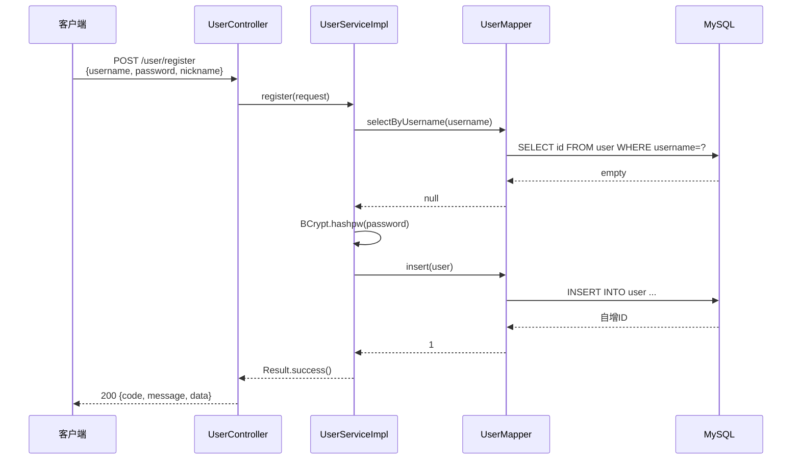
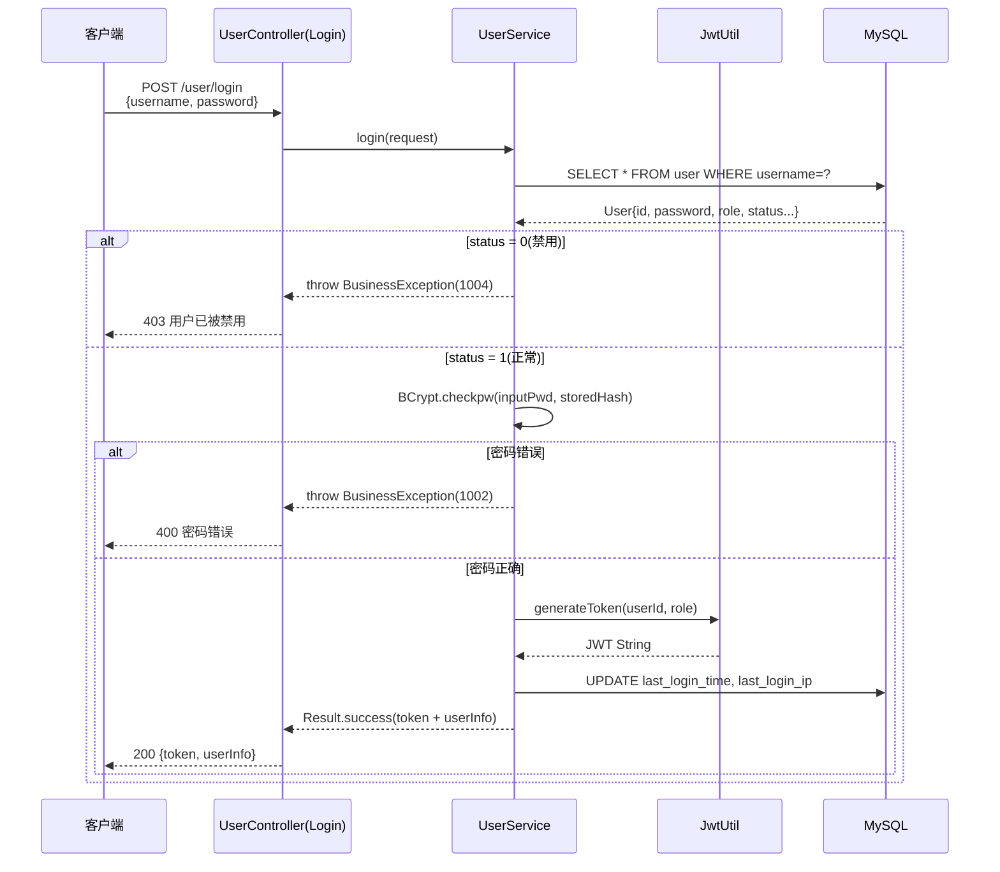
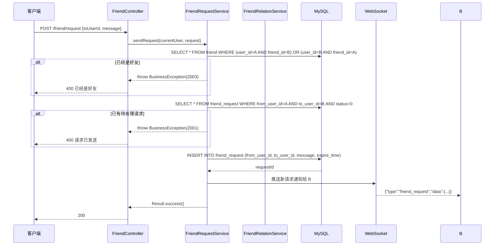
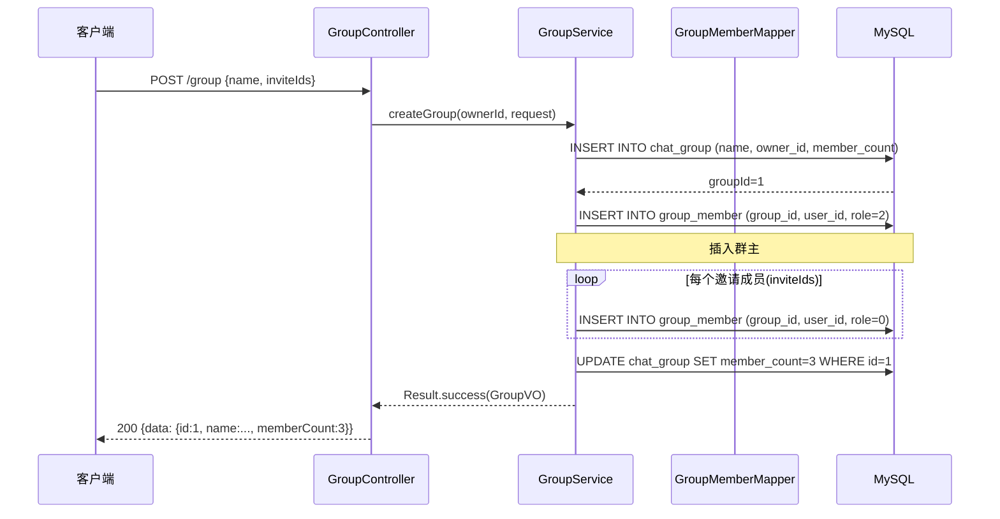
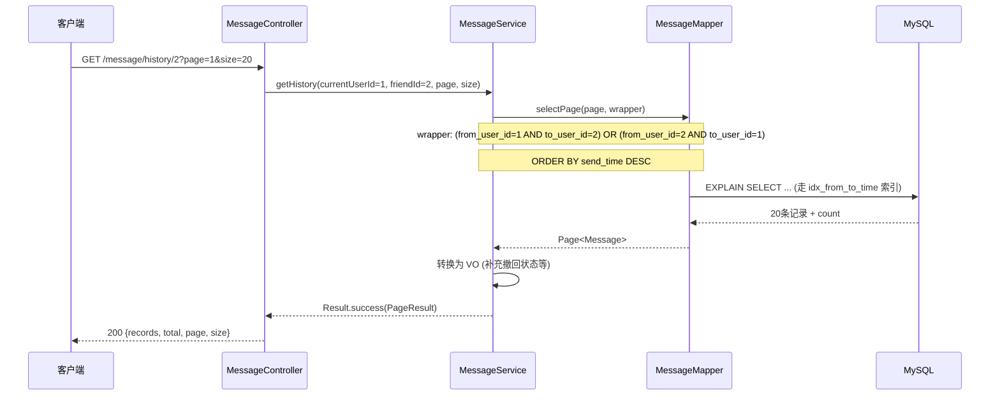
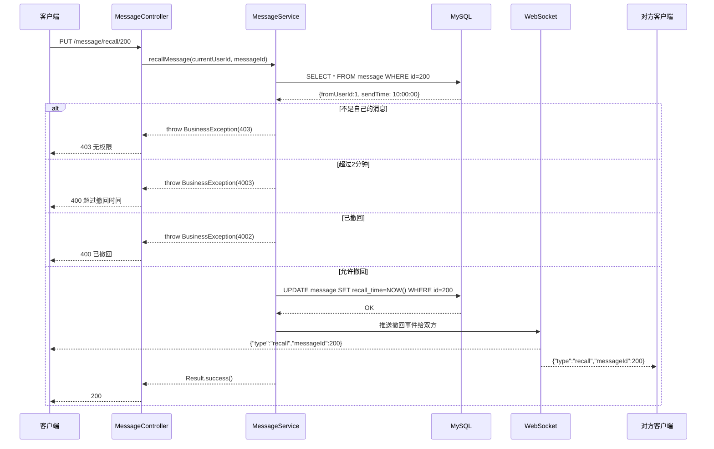

# 接口设计说明书

## WebChat 企业级在线即时通讯系统

| 文档版本 | 修改日期 | 修改人 | 修改说明 |
|----------|----------|--------|----------|
| V1.0 | 2026-05-13 | 架构组 | 企业级完整接口文档 |

---

## 第1章 接口设计总则

### 1.1 设计规范

| 规范项 | 说明 |
|--------|------|
| 协议 | HTTP/1.1 + HTTPS |
| 基础 URL | 开发: `http://localhost:8080` / 生产: `https://chat.example.com/api` |
| 请求格式 | `application/json`（文件上传使用 `multipart/form-data`） |
| 响应格式 | `application/json;charset=utf-8` |
| 认证方式 | `Authorization: Bearer <JWT_TOKEN>` |
| 分页参数 | `?page=1&size=20`（page 从 1 开始） |
| 日期格式 | ISO 8601: `yyyy-MM-dd'T'HH:mm:ss` |
| HTTP 方法语义 | GET=查询, POST=创建, PUT=更新, DELETE=删除 |

### 1.2 统一响应结构

```json
// 成功响应
{
    "code": 200,
    "message": "success",
    "data": { ... }    // 泛型，具体见各接口
}

// 分页响应
{
    "code": 200,
    "message": "success",
    "data": {
        "records": [ ... ],
        "total": 1000,
        "page": 1,
        "size": 20
    }
}

// 错误响应
{
    "code": 4001,
    "message": "消息不存在",
    "data": null
}
```

### 1.3 全局错误码

| code | HTTP 状态码 | message | 说明 | 处理建议 |
|:----:|:----------:|---------|------|----------|
| 200 | 200 | success | 请求成功 | - |
| 400 | 400 | bad request | 请求参数错误 | 检查请求参数格式 |
| 401 | 401 | unauthorized | 未认证/Token无效/过期 | 重新登录获取新 Token |
| 403 | 403 | forbidden | 无权限 | 确认用户角色是否有权限 |
| 404 | 404 | not found | 资源不存在 | 检查资源 ID 是否正确 |
| 405 | 405 | method not allowed | 请求方法不允许 | 检查 HTTP 方法 |
| 429 | 429 | too many requests | 请求过于频繁 | 稍后重试 |
| 500 | 500 | internal server error | 服务器内部错误 | 联系运维，查看日志 |
| 1001 | 400 | user not found | 用户不存在 | 检查用户 ID/用户名 |
| 1002 | 400 | password error | 密码错误 | 重新输入密码 |
| 1003 | 400 | username already exists | 用户名已存在 | 更换用户名 |
| 1004 | 403 | user disabled | 用户已被禁用 | 联系管理员解禁 |
| 2001 | 400 | friend request already sent | 好友请求已发送 | 等待对方处理 |
| 2002 | 400 | friend request expired | 好友请求已过期 | 重新发送请求 |
| 2003 | 400 | already friends | 已经是好友 | 无需重复添加 |
| 3001 | 404 | group not found | 群组不存在 | 检查群组 ID |
| 3002 | 403 | not group member | 不是群成员 | - |
| 3003 | 400 | member already exists | 成员已在群中 | - |
| 3004 | 403 | member is muted | 成员被禁言 | 联系群主/管理员 |
| 4001 | 404 | message not found | 消息不存在 | 检查消息 ID |
| 4002 | 400 | message already recalled | 消息已撤回 | - |
| 4003 | 400 | message recall expired | 消息已超过撤回时间(2min) | - |
| 5001 | 400 | file too large | 文件过大 | 压缩后重新上传 |
| 5002 | 400 | file type not allowed | 文件类型不允许 | 检查文件格式 |
| 5003 | 500 | file upload failed | 文件上传失败 | 重试或联系运维 |

### 1.4 通用请求头

| 头 | 必填 | 说明 |
|----|:----:|------|
| Authorization | 是(除登录/注册) | `Bearer eyJhbGciOiJIUzI1NiJ9...` |
| Content-Type | 是 | `application/json` 或 `multipart/form-data` |
| Accept | 否 | `application/json` |

---

## 第2章 用户模块 API

### 2.1 用户注册

> 基础路径: `/user`

**基本信息**

| 项目 | 值 |
|------|------|
| 端点 | `POST /user/register` |
| 认证 | 否 |
| Content-Type | `application/json` |

**调用时序**

> 请在 Word 中通过插件或在线工具将以下 Mermaid 代码渲染为图片



**请求参数**

| 参数名 | 位置 | 类型 | 必填 | 说明 | 校验规则 |
|--------|:----:|------|:----:|------|----------|
| username | body | String | 是 | 用户名 | 4-50 字符，字母/数字/下划线 |
| password | body | String | 是 | 密码 | 8-50 字符，需含字母和数字 |
| nickname | body | String | 是 | 昵称 | 1-50 字符 |

**请求示例**

```json
{
    "username": "alice",
    "password": "Abc123456",
    "nickname": "Alice"
}
```

**响应示例**

```json
{
    "code": 200,
    "message": "success",
    "data": {
        "id": 1,
        "username": "alice",
        "nickname": "Alice"
    }
}
```

---

### 2.2 用户登录

> 基础路径: `/user`

**基本信息**

| 项目 | 值 |
|------|------|
| 端点 | `POST /user/login` |
| 认证 | 否 |

**调用时序**

> 请在 Word 中通过插件或在线工具将以下 Mermaid 代码渲染为图片



**请求参数**

| 参数名 | 类型 | 必填 | 说明 |
|--------|------|:----:|------|
| username | String | 是 | 用户名 |
| password | String | 是 | 密码 |

**请求示例**

```json
{
    "username": "alice",
    "password": "Abc123456"
}
```

**响应示例**

```json
{
    "code": 200,
    "message": "success",
    "data": {
        "token": "eyJhbGciOiJIUzI1NiJ9.eyJzdWIiOiJ1c2VySWQ6MSIsInJvbGUiOiJ1c2VyIiwiaWF0IjoxNzE1NTAwMDAwLCJleHAiOjE3MTU1ODY0MDB9.xxx",
        "userInfo": {
            "id": 1,
            "username": "alice",
            "nickname": "Alice",
            "avatar": "https://oss.aliyuncs.com/avatars/default.png",
            "signature": null,
            "email": null,
            "role": "user",
            "status": 1
        }
    }
}
```

---

### 2.3 获取当前用户信息

**基本信息**

| 项目 | 值 |
|------|------|
| 端点 | `GET /user/me` |
| 认证 | 是 (Bearer Token) |

**请求参数**: 无

**响应示例**

```json
{
    "code": 200,
    "message": "success",
    "data": {
        "id": 1,
        "username": "alice",
        "nickname": "Alice",
        "avatar": "https://oss.aliyuncs.com/avatars/1.png",
        "signature": "Hello World",
        "email": "alice@example.com",
        "role": "user",
        "status": 1,
        "lastLoginIp": "192.168.1.100",
        "lastLoginTime": "2026-05-13T10:00:00",
        "createdAt": "2026-01-01T00:00:00"
    }
}
```

---

### 2.4 更新个人资料

**基本信息**

| 项目 | 值 |
|------|------|
| 端点 | `PUT /user/profile` |
| 认证 | 是 (Bearer Token) |

**请求参数**

| 参数名 | 类型 | 必填 | 说明 |
|--------|------|:----:|------|
| nickname | String | 否 | 新昵称，1-50 字符 |
| signature | String | 否 | 新个性签名，最多 100 字符 |

**请求示例**

```json
{
    "nickname": "NewAlice",
    "signature": "新的签名"
}
```

**响应示例**

```json
{
    "code": 200,
    "message": "success",
    "data": null
}
```

---

### 2.5 上传头像

**基本信息**

| 项目 | 值 |
|------|------|
| 端点 | `POST /user/avatar` |
| 认证 | 是 (Bearer Token) |
| Content-Type | `multipart/form-data` |

**请求参数**

| 参数名 | 类型 | 必填 | 说明 |
|--------|------|:----:|------|
| file | File | 是 | 头像图片，jpg/png/gif/webp，≤ 5MB |

**响应示例**

```json
{
    "code": 200,
    "message": "success",
    "data": {
        "avatar": "https://oss.aliyuncs.com/avatars/1/xxx.jpg"
    }
}
```

---

### 2.6 获取用户公开信息

**基本信息**

| 项目 | 值 |
|------|------|
| 端点 | `GET /user/{userId}` |
| 认证 | 是 (Bearer Token) |

**路径参数**

| 参数名 | 类型 | 必填 | 说明 |
|--------|:----:|:----:|------|
| userId | Long | 是 | 目标用户 ID |

**响应示例**

```json
{
    "code": 200,
    "message": "success",
    "data": {
        "id": 2,
        "username": "bob",
        "nickname": "Bob",
        "avatar": "https://oss.aliyuncs.com/avatars/bob.png",
        "signature": "Hi there"
    }
}
```

---

## 第3章 好友模块 API

### 3.1 搜索用户

**基本信息**

| 项目 | 值 |
|------|------|
| 端点 | `GET /friend/search` |
| 认证 | 是 (Bearer Token) |

**请求参数**

| 参数名 | 类型 | 必填 | 说明 |
|--------|:----:|:----:|------|
| keyword | String | 是 | 搜索关键词，匹配用户名或昵称，最少 2 字符 |

**响应示例**

```json
{
    "code": 200,
    "message": "success",
    "data": [
        {
            "id": 2,
            "username": "bob",
            "nickname": "Bob",
            "avatar": "https://oss.aliyuncs.com/avatars/bob.png",
            "isFriend": false
        },
        {
            "id": 3,
            "username": "bobby",
            "nickname": "Bobby",
            "avatar": "https://oss.aliyuncs.com/avatars/bobby.png",
            "isFriend": true
        }
    ]
}
```

---

### 3.2 发送好友请求

**基本信息**

| 项目 | 值 |
|------|------|
| 端点 | `POST /friend/request` |
| 认证 | 是 (Bearer Token) |

**调用时序**

> 请在 Word 中通过插件或在线工具将以下 Mermaid 代码渲染为图片



**请求参数**

| 参数名 | 类型 | 必填 | 说明 |
|--------|------|:----:|------|
| toUserId | Long | 是 | 目标用户 ID |
| message | String | 否 | 验证消息，最多 100 字符 |

**请求示例**

```json
{
    "toUserId": 2,
    "message": "你好，我是Alice"
}
```

**响应示例**

```json
{
    "code": 200,
    "message": "success",
    "data": null
}
```

---

### 3.3 获取收到的好友请求

**基本信息**

| 项目 | 值 |
|------|------|
| 端点 | `GET /friend/requests` |
| 认证 | 是 (Bearer Token) |

**响应示例**

```json
{
    "code": 200,
    "message": "success",
    "data": [
        {
            "id": 1,
            "fromUserId": 2,
            "fromUsername": "bob",
            "fromNickname": "Bob",
            "fromAvatar": "https://oss.aliyuncs.com/avatars/bob.png",
            "message": "加个好友",
            "status": 0,
            "createdAt": "2026-05-13T10:00:00"
        }
    ]
}
```

---

### 3.4 处理好友请求

**基本信息**

| 项目 | 值 |
|------|------|
| 端点 | `PUT /friend/request/{requestId}` |
| 认证 | 是 (Bearer Token) |

**路径参数**

| 参数名 | 类型 | 必填 | 说明 |
|--------|:----:|:----:|------|
| requestId | Long | 是 | 请求 ID |

**请求参数**

| 参数名 | 类型 | 必填 | 说明 |
|--------|------|:----:|------|
| status | Integer | 是 | 1=同意 2=拒绝 |

**请求示例**

```json
{
    "status": 1
}
```

**响应示例**

```json
{
    "code": 200,
    "message": "success",
    "data": null
}
```

---

### 3.5 获取好友列表

**基本信息**

| 项目 | 值 |
|------|------|
| 端点 | `GET /friend/list` |
| 认证 | 是 (Bearer Token) |

**响应示例**

```json
{
    "code": 200,
    "message": "success",
    "data": [
        {
            "groupName": "我的好友",
            "friends": [
                {
                    "friendId": 2,
                    "nickname": "Bob",
                    "remark": null,
                    "avatar": "https://oss.aliyuncs.com/avatars/bob.png",
                    "signature": "Hello",
                    "isOnline": true,
                    "isTop": 0,
                    "unreadCount": 3
                }
            ]
        },
        {
            "groupName": "同事",
            "friends": [
                {
                    "friendId": 3,
                    "nickname": "Charlie",
                    "remark": "王工",
                    "avatar": "https://oss.aliyuncs.com/avatars/charlie.png",
                    "signature": "Working...",
                    "isOnline": false,
                    "isTop": 1,
                    "unreadCount": 0
                }
            ]
        }
    ]
}
```

---

### 3.6 删除好友

**基本信息**

| 项目 | 值 |
|------|------|
| 端点 | `DELETE /friend/{friendId}` |
| 认证 | 是 (Bearer Token) |

**路径参数**

| 参数名 | 类型 | 必填 | 说明 |
|--------|:----:|:----:|------|
| friendId | Long | 是 | 好友的用户 ID |

**响应示例**

```json
{
    "code": 200,
    "message": "success",
    "data": null
}
```

---

### 3.7 移动好友分组

**基本信息**

| 项目 | 值 |
|------|------|
| 端点 | `PUT /friend/{friendId}/group` |
| 认证 | 是 (Bearer Token) |

**请求参数**

| 参数名 | 类型 | 必填 | 说明 |
|--------|------|:----:|------|
| groupName | String | 是 | 目标分组名称，若不存在则自动创建 |

**请求示例**

```json
{
    "groupName": "项目组"
}
```

---

### 3.8 修改好友备注

**基本信息**

| 项目 | 值 |
|------|------|
| 端点 | `PUT /friend/{friendId}/remark` |
| 认证 | 是 (Bearer Token) |

**请求参数**

| 参数名 | 类型 | 必填 | 说明 |
|--------|------|:----:|------|
| remark | String | 是 | 新备注，最多 50 字符 |

---

## 第4章 群组模块 API

### 4.1 创建群组

**基本信息**

| 项目 | 值 |
|------|------|
| 端点 | `POST /group` |
| 认证 | 是 (Bearer Token) |

**调用时序**

> 请在 Word 中通过插件或在线工具将以下 Mermaid 代码渲染为图片



**请求参数**

| 参数名 | 类型 | 必填 | 说明 |
|--------|------|:----:|------|
| name | String | 是 | 群名称，1-50 字符 |
| inviteIds | Long[] | 否 | 初始邀请的用户 ID 列表 |

**请求示例**

```json
{
    "name": "项目讨论组",
    "inviteIds": [2, 3]
}
```

**响应示例**

```json
{
    "code": 200,
    "message": "success",
    "data": {
        "id": 1,
        "name": "项目讨论组",
        "avatar": null,
        "ownerId": 1,
        "memberCount": 3,
        "notice": null,
        "createdAt": "2026-05-13T10:00:00"
    }
}
```

---

### 4.2 获取群组列表

**基本信息**

| 项目 | 值 |
|------|------|
| 端点 | `GET /group/list` |
| 认证 | 是 (Bearer Token) |

**响应示例**

```json
{
    "code": 200,
    "message": "success",
    "data": [
        {
            "id": 1,
            "name": "项目讨论组",
            "avatar": null,
            "ownerId": 1,
            "memberCount": 3,
            "notice": "欢迎新成员",
            "unreadCount": 5,
            "lastMessage": {
                "content": "大家好",
                "sendTime": "2026-05-13T10:30:00",
                "fromNickname": "Alice"
            }
        }
    ]
}
```

---

### 4.3 获取群组详情

**基本信息**

| 项目 | 值 |
|------|------|
| 端点 | `GET /group/{groupId}` |
| 认证 | 是 (Bearer Token) |

**响应示例**

```json
{
    "code": 200,
    "message": "success",
    "data": {
        "id": 1,
        "name": "项目讨论组",
        "avatar": null,
        "ownerId": 1,
        "memberCount": 3,
        "notice": "欢迎新成员",
        "myRole": 2,
        "isMuted": false,
        "createdAt": "2026-05-13T10:00:00"
    }
}
```

---

### 4.4 邀请成员

**基本信息**

| 项目 | 值 |
|------|------|
| 端点 | `POST /group/invite` |
| 认证 | 是 (Bearer Token) |

**请求参数**

| 参数名 | 类型 | 必填 | 说明 |
|--------|------|:----:|------|
| groupId | Long | 是 | 群组 ID |
| userIds | Long[] | 是 | 邀请的用户 ID 数组 |

**请求示例**

```json
{
    "groupId": 1,
    "userIds": [4, 5]
}
```

---

### 4.5 退出群组

**基本信息**

| 项目 | 值 |
|------|------|
| 端点 | `DELETE /group/{groupId}/quit` |
| 认证 | 是 (Bearer Token) |

**约束**: 群主不可退出，需先转让群主或解散群组。

---

### 4.6 解散群组

**基本信息**

| 项目 | 值 |
|------|------|
| 端点 | `DELETE /group/{groupId}/disband` |
| 认证 | 是 (Bearer Token) |
| 权限 | 仅群主 |

---

### 4.7 获取群成员列表

**基本信息**

| 项目 | 值 |
|------|------|
| 端点 | `GET /group/{groupId}/members` |
| 认证 | 是 (Bearer Token) |

**响应示例**

```json
{
    "code": 200,
    "message": "success",
    "data": [
        {
            "userId": 1,
            "nickname": "Alice",
            "avatar": "https://oss.aliyuncs.com/avatars/1.png",
            "role": 2,
            "joinTime": "2026-05-13T10:00:00",
            "isMuted": false
        },
        {
            "userId": 2,
            "nickname": "Bob",
            "avatar": "https://oss.aliyuncs.com/avatars/2.png",
            "role": 0,
            "joinTime": "2026-05-13T10:05:00",
            "isMuted": true,
            "muteEndTime": "2026-05-14T10:05:00"
        }
    ]
}
```

---

### 4.8 更新群公告

**基本信息**

| 项目 | 值 |
|------|------|
| 端点 | `PUT /group/{groupId}/notice` |
| 认证 | 是 (Bearer Token) |
| 权限 | 群主/管理员 |

**请求参数**

| 参数名 | 类型 | 必填 | 说明 |
|--------|------|:----:|------|
| notice | String | 是 | 公告内容，最多 200 字符 |

---

### 4.9 群成员管理接口

| 端点 | 方法 | 权限 | 说明 | 请求参数 |
|------|:----:|------|------|----------|
| `/group/{groupId}/member/{memberId}/set-admin` | PUT | 群主 | 设为管理员 | 无 |
| `/group/{groupId}/member/{memberId}/remove-admin` | PUT | 群主 | 取消管理员 | 无 |
| `/group/{groupId}/member/{memberId}/mute` | PUT | 群主/管理 | 禁言成员 | `{minutes: 60}` |
| `/group/{groupId}/member/{memberId}/unmute` | PUT | 群主/管理 | 解除禁言 | 无 |
| `/group/{groupId}/member/{memberId}` | DELETE | 群主/管理 | 移除成员 | 无 |
| `/group/{groupId}/members/batch-mute` | PUT | 群主/管理 | 批量禁言 | `{memberIds:[1,2], minutes:30}` |

**禁言请求示例**:

```json
{
    "minutes": 60
}
```

---

### 4.10 获取群聊历史消息

**基本信息**

| 项目 | 值 |
|------|------|
| 端点 | `GET /group/message/{groupId}` |
| 认证 | 是 (Bearer Token) |

**查询参数**

| 参数名 | 类型 | 必填 | 默认值 | 说明 |
|--------|:----:|:----:|:-----:|------|
| page | Integer | 否 | 1 | 页码 |
| size | Integer | 否 | 20 | 每页条数，最大 100 |

**响应示例**

```json
{
    "code": 200,
    "message": "success",
    "data": {
        "records": [
            {
                "id": 100,
                "groupId": 1,
                "fromUserId": 1,
                "fromNickname": "Alice",
                "fromAvatar": "https://oss.aliyuncs.com/avatars/1.png",
                "messageType": 1,
                "content": "大家好",
                "sendTime": "2026-05-13T10:30:00",
                "isRecalled": false
            }
        ],
        "total": 150,
        "page": 1,
        "size": 20
    }
}
```

---

### 4.11 清除群组未读

**基本信息**

| 项目 | 值 |
|------|------|
| 端点 | `PUT /group/{groupId}/read` |
| 认证 | 是 (Bearer Token) |

---

## 第5章 私聊消息模块 API

### 5.1 获取私聊历史消息

**基本信息**

| 项目 | 值 |
|------|------|
| 端点 | `GET /message/history/{friendId}` |
| 认证 | 是 (Bearer Token) |

**调用时序**

> 请在 Word 中通过插件或在线工具将以下 Mermaid 代码渲染为图片



**查询参数**

| 参数名 | 类型 | 必填 | 默认值 | 说明 |
|--------|:----:|:----:|:-----:|------|
| page | Integer | 否 | 1 | 页码 |
| size | Integer | 否 | 20 | 每页条数，最大 100 |

**响应示例**

```json
{
    "code": 200,
    "message": "success",
    "data": {
        "records": [
            {
                "id": 200,
                "fromUserId": 1,
                "toUserId": 2,
                "messageType": 1,
                "content": "你好！",
                "isRead": true,
                "sendTime": "2026-05-13T10:00:00",
                "isRecalled": false
            },
            {
                "id": 199,
                "fromUserId": 2,
                "toUserId": 1,
                "messageType": 4,
                "content": "https://oss.aliyuncs.com/voice/xxx.amr",
                "duration": 15,
                "isRead": true,
                "sendTime": "2026-05-13T09:59:00",
                "isRecalled": false
            }
        ],
        "total": 500,
        "page": 1,
        "size": 20
    }
}
```

---

### 5.2 标记消息已读

**基本信息**

| 项目 | 值 |
|------|------|
| 端点 | `PUT /message/read/{friendId}` |
| 认证 | 是 (Bearer Token) |

**说明**: 将当前用户与指定好友之间的所有未读消息标记为已读。

**响应示例**

```json
{
    "code": 200,
    "message": "success",
    "data": null
}
```

---

### 5.3 获取未读消息统计

**基本信息**

| 项目 | 值 |
|------|------|
| 端点 | `GET /message/unread/count` |
| 认证 | 是 (Bearer Token) |

**响应示例**

```json
{
    "code": 200,
    "message": "success",
    "data": {
        "totalUnread": 10,
        "unreadDetails": [
            {
                "friendId": 2,
                "friendNickname": "Bob",
                "friendAvatar": "https://oss.aliyuncs.com/avatars/bob.png",
                "unreadCount": 3,
                "lastMessage": "在吗？",
                "lastSendTime": "2026-05-13T10:30:00"
            },
            {
                "friendId": 3,
                "friendNickname": "Charlie",
                "friendAvatar": "https://oss.aliyuncs.com/avatars/charlie.png",
                "unreadCount": 7,
                "lastMessage": "好的收到",
                "lastSendTime": "2026-05-13T10:25:00"
            }
        ]
    }
}
```

---

### 5.4 撤回消息

**基本信息**

| 项目 | 值 |
|------|------|
| 端点 | `PUT /message/recall/{messageId}` |
| 认证 | 是 (Bearer Token) |

**调用时序**

> 请在 Word 中通过插件或在线工具将以下 Mermaid 代码渲染为图片



---

### 5.5 上传图片

**基本信息**

| 项目 | 值 |
|------|------|
| 端点 | `POST /message/upload/image` |
| 认证 | 是 (Bearer Token) |
| Content-Type | `multipart/form-data` |

**请求参数**

| 参数名 | 类型 | 必填 | 说明 |
|--------|------|:----:|------|
| file | File | 是 | 图片文件，jpg/png/gif/webp，≤ 10MB |

**响应示例**

```json
{
    "code": 200,
    "message": "success",
    "data": {
        "url": "https://oss.aliyuncs.com/images/xxx.jpg"
    }
}
```

---

### 5.6 上传语音

**基本信息**

| 项目 | 值 |
|------|------|
| 端点 | `POST /message/upload/voice` |
| 认证 | 是 (Bearer Token) |
| Content-Type | `multipart/form-data` |

**请求参数**

| 参数名 | 类型 | 必填 | 说明 |
|--------|------|:----:|------|
| file | File | 是 | 语音文件，amr/mp3/wav，≤ 10MB |

**响应示例**

```json
{
    "code": 200,
    "message": "success",
    "data": {
        "url": "https://oss.aliyuncs.com/voice/xxx.amr",
        "duration": 15
    }
}
```

---

### 5.7 下载聊天记录

**基本信息**

| 项目 | 值 |
|------|------|
| 端点 | `GET /message/download/{friendId}` |
| 认证 | 是 (Bearer Token) |
| 响应类型 | `text/plain` (文件下载) |

**查询参数**

| 参数名 | 类型 | 必填 | 默认值 | 说明 |
|--------|:----:|:----:|:-----:|------|
| limit | Integer | 否 | 100 | 导出的消息条数，最大 1000 |

---

### 5.8 音频代理

**基本信息**

| 项目 | 值 |
|------|------|
| 端点 | `GET /message/proxy-audio` |
| 认证 | 是 (Bearer Token) |
| 响应类型 | `audio/*` |

**查询参数**

| 参数名 | 类型 | 必填 | 说明 |
|--------|:----:|:----:|------|
| url | String | 是 | OSS 音频文件的完整 URL |

**说明**: 用于解决浏览器跨域限制无法直接播放 OSS 音频的问题。

---

## 第6章 表情模块 API

### 6.1 获取系统表情

```
GET /emoji/system
```

```json
{
    "code": 200,
    "message": "success",
    "data": [
        {
            "id": 1,
            "name": "smile",
            "url": "https://oss.aliyuncs.com/emoji/smile.png",
            "category": "default"
        },
        {
            "id": 2,
            "name": "laugh",
            "url": "https://oss.aliyuncs.com/emoji/laugh.png",
            "category": "default"
        }
    ]
}
```

### 6.2 获取用户自定义表情

```
GET /emoji/user
```

### 6.3 上传自定义表情

```
POST /emoji/upload
```

| 参数 | 必填 | 说明 |
|------|:----:|------|
| file | 是 | 表情图片，png/gif/webp，≤ 2MB |
| name | 是 | 表情名称 |

### 6.4 删除自定义表情

```
DELETE /emoji/{emojiId}
```

---

## 第7章 好友印象模块 API

### 7.1 添加印象

```
POST /impression
```

```json
{
    "toUserId": 2,
    "content": "靠谱"
}
```

### 7.2 获取别人给我的印象

```
GET /impression/to-me
```

### 7.3 获取我给出的印象

```
GET /impression/by-me
```

### 7.4 删除印象

```
DELETE /impression/{impressionId}
```

---

## 第8章 系统通知模块 API

### 8.1 发送系统通知

```
POST /system-notification/send
```
权限: 管理员

```json
{
    "title": "系统维护通知",
    "content": "系统将于今晚 2:00-4:00 进行例行维护"
}
```

### 8.2 获取未读通知

```
GET /system-notification/unread
```

### 8.3 标记通知已读

```
PUT /system-notification/read/{notificationId}
```

---

## 第9章 管理后台模块 API

### 9.1 获取数据概览

```
GET /admin/stats
```

```json
{
    "code": 200,
    "message": "success",
    "data": {
        "totalUsers": 1500,
        "todayNewUsers": 12,
        "totalGroups": 200,
        "totalMessages": 50000,
        "todayMessages": 1200,
        "onlineUsers": 340,
        "recentUserTrend": [
            {"date": "2026-05-07", "count": 1450},
            {"date": "2026-05-08", "count": 1460},
            {"date": "2026-05-09", "count": 1480},
            {"date": "2026-05-10", "count": 1490},
            {"date": "2026-05-11", "count": 1495},
            {"date": "2026-05-12", "count": 1500},
            {"date": "2026-05-13", "count": 1512}
        ],
        "recentMessageTrend": [
            {"date": "2026-05-07", "count": 1100},
            {"date": "2026-05-08", "count": 1150},
            {"date": "2026-05-09", "count": 1080},
            {"date": "2026-05-10", "count": 1200},
            {"date": "2026-05-11", "count": 1180},
            {"date": "2026-05-12", "count": 1220},
            {"date": "2026-05-13", "count": 1200}
        ]
    }
}
```

### 9.2 获取用户列表

```
GET /admin/users?page=1&size=20&keyword=alice
```

```json
{
    "code": 200,
    "message": "success",
    "data": {
        "records": [
            {
                "id": 1,
                "username": "alice",
                "nickname": "Alice",
                "email": "alice@example.com",
                "role": "user",
                "status": 1,
                "lastLoginTime": "2026-05-13T10:00:00",
                "createdAt": "2026-01-01T00:00:00"
            }
        ],
        "total": 1,
        "page": 1,
        "size": 20
    }
}
```

### 9.3 启用/禁用用户

```
PUT /admin/user/{userId}/status?status=0
```

### 9.4 消息审计

```
GET /admin/messages?page=1&size=20&keyword=test&messageType=1&startTime=2026-05-01T00:00:00&endTime=2026-05-13T23:59:59
```

```json
{
    "code": 200,
    "message": "success",
    "data": {
        "records": [
            {
                "id": 100,
                "fromUserId": 1,
                "fromNickname": "Alice",
                "toUserId": 2,
                "toNickname": "Bob",
                "messageType": 1,
                "content": "消息内容",
                "sendTime": "2026-05-13T10:00:00"
            }
        ],
        "total": 5000,
        "page": 1,
        "size": 20
    }
}
```

### 9.5 获取管理员通知历史

```
GET /admin/notifications
```

---

## 第10章 RTC 音视频模块 API

### 10.1 获取 RTC Token

```
POST /rtc/token
```

```json
{
    "channelId": "channel_user1_user2",
    "userId": "user_1"
}
```

```json
{
    "code": 200,
    "message": "success",
    "data": {
        "token": "xxxxx",
        "channelId": "channel_user1_user2",
        "userId": "user_1",
        "appId": "aliyun_rtc_app_id",
        "nonce": "random_nonce_string",
        "timestamp": 1715500000
    }
}
```

---

## 第11章 WebSocket 协议详解

### 11.1 连接建立

```
ws://host/ws?token=<JWT_TOKEN>
```

### 11.2 消息协议

```javascript
// ============================================
// 客户端 -> 服务端 消息格式
// ============================================

// 私聊消息
{
    "type": "message",
    "data": {
        "toUserId": 2,
        "messageType": 1,       // 1=文本 2=图片 3=文件 4=语音
        "content": "你好！",     // 文本内容 或 OSS URL
        "duration": null         // 语音消息时长(秒)，非语音时为null
    }
}

// 群聊消息
{
    "type": "group_message",
    "data": {
        "groupId": 1,
        "messageType": 1,
        "content": "大家好"
    }
}

// 通话信令 - 发起呼叫
{
    "type": "call",
    "data": {
        "action": "call",            // call | accept | reject | end_call
        "toUserId": 2,
        "callType": "video",         // video | audio
        "channelId": "channel_xxx"
    }
}

// 通话信令 - SDP/ICE 交换
{
    "type": "call",
    "data": {
        "action": "offer",           // offer | answer | ice_candidate
        "fromUserId": 1,
        "sdp": "v=0\no=- ...",      // SDP 描述
        "candidate": null,           // ICE Candidate
        "channelId": "channel_xxx"
    }
}

// 心跳
{
    "type": "ping"
}


// ============================================
// 服务端 -> 客户端 消息格式
// ============================================

// 接收私聊消息
{
    "type": "message",
    "data": {
        "messageId": 200,
        "fromUserId": 1,
        "fromNickname": "Alice",
        "fromAvatar": "https://oss.aliyuncs.com/avatars/1.png",
        "messageType": 1,
        "content": "你好！",
        "sendTime": "2026-05-13T10:00:00"
    }
}

// 接收群聊消息
{
    "type": "group_message",
    "data": {
        "messageId": 100,
        "groupId": 1,
        "fromUserId": 1,
        "fromNickname": "Alice",
        "fromAvatar": "https://oss.aliyuncs.com/avatars/1.png",
        "messageType": 1,
        "content": "大家好",
        "sendTime": "2026-05-13T10:30:00"
    }
}

// 消息发送确认(ACK)
{
    "type": "ack",
    "data": {
        "messageId": 200,
        "sendTime": "2026-05-13T10:00:00"
    }
}

// 消息撤回通知
{
    "type": "recall",
    "data": {
        "messageId": 200,
        "fromUserId": 1
    }
}

// 在线状态变更
{
    "type": "online_status",
    "data": {
        "userId": 2,
        "online": true,      // true=上线 false=下线
        "lastOnlineTime": null
    }
}

// 好友请求通知
{
    "type": "friend_request",
    "data": {
        "requestId": 1,
        "fromUserId": 2,
        "fromNickname": "Bob",
        "fromAvatar": "https://oss.aliyuncs.com/avatars/bob.png",
        "message": "加个好友"
    }
}

// 新系统通知
{
    "type": "notification",
    "data": {
        "id": 1,
        "title": "系统维护通知",
        "content": "...",
        "createdAt": "2026-05-13T09:00:00"
    }
}

// 心跳回复
{
    "type": "pong"
}
```

### 11.3 错误消息

```json
{
    "type": "error",
    "data": {
        "code": 3004,
        "message": "你已被禁言"
    }
}
```

### 11.4 WebSocket 状态码

| 状态码 | 含义 | 触发场景 |
|:------:|------|----------|
| 1000 | 正常关闭 | 用户退出登录/关闭页面 |
| 1008 | 策略违规 | Token 验证失败 |
| 1011 | 服务端错误 | 内部异常导致连接断开 |

---

## 第12章 接口变更记录

| 版本 | 日期 | 变更描述 |
|------|------|----------|
| V1.0 | 2026-05-13 | 初始版本 |
